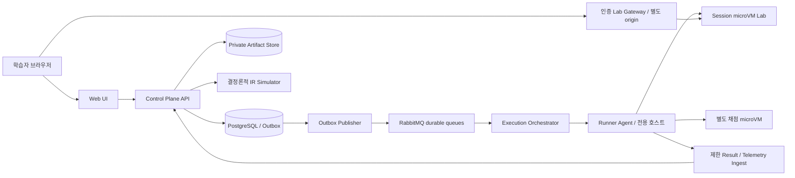
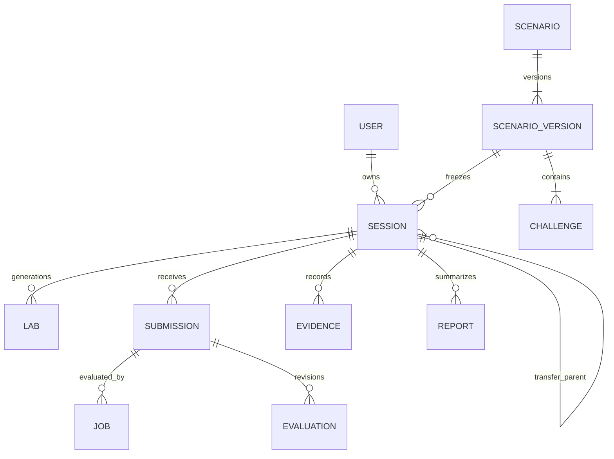

# SecDrill 개발 문서 통합본

작성일 2026-10-04 · 버전 0.1 · 설계 제안 초안

개별 docs 문서가 단일 출처입니다. 다음 내용은 편집 가능한 통합 읽기본입니다.


출처 파일: `docs/00-common-contract.md`

# SecDrill 공통 계약

이 문서는 모든 설계에서 같은 단어와 같은 불변식을 사용하기 위한 기준이다. 아래 수치는 초기 운영 가정이며 실측 후 ADR로 변경한다.

## 용어

| 용어 | 정의 |
|---|---|
| Scenario | 사건 중심 콘텐츠의 논리적 식별자 |
| ScenarioVersion | 매니페스트·이미지·평가 정책을 고정한 불변 버전 |
| Drill | 특정 역량을 반복하는 훈련 과업 |
| Challenge | ScenarioVersion에 속하는 CTF·워게임 목표 |
| Session | 한 학습자가 한 버전·모드·seed로 수행하는 시도 |
| Lab | Session에 귀속된 일시적 실행 환경 |
| Submission | 플래그·패치·탐지 규칙·보고서의 불변 제출 |
| Execution | 특정 제출을 검증하는 한 실행; 재시도는 attempt 증가 |
| EvaluationRevision | 같은 제출의 평가 정책별 불변 판정 이력 |
| Evidence Ledger | 관측·행동·도움·판정 출처를 append-only로 기록하는 원장 |
| Projection | 원본 증거와 정책 버전에서 재계산 가능한 파생값 |
| Replay | 기록된 사건과 상태를 시간순으로 검토하는 기능 |
| Re-execution | 환경을 새로 만들어 실제 코드를 다시 실행하는 기능; Replay와 구별 |
| Transfer | 다른 사건 계열에서 힌트 없이 같은 역량을 검증하는 후속 Session |
| Mutant | 대표적인 불완전한 패치 또는 탐지 규칙; 콘텐츠 검증용 |
| Oracle | 채점기만 아는 정답 상태·숨은 테스트·공격 라벨 |
| Lease / fencing token | 작업 소유 기간 / 오래된 작업 결과를 거절하는 단조 증가 토큰 |

## 제품과 데이터 불변식

- 모드 enum: `CTF`, `WARGAME`, `PURPLE`, `PATCH`, `DETECTION`, `INVESTIGATE`. MVP는 앞의 세 모드만 독립 진입을 제공하고 나머지는 PURPLE의 단계다.
- 학습 단계 enum: `ANALYZE`, `ATTACK`, `OBSERVE`, `DETECT`, `CONTAIN`, `PATCH`, `VERIFY`, `POSTMORTEM`. Transfer는 같은 세션 단계가 아니라 연결된 새 Session이다.
- 사용자 점수 실패와 플랫폼 실패를 구분한다. 플랫폼 실패는 `SYSTEM_ERROR`, 역량 실패는 `FAIL`이다. SYSTEM_ERROR는 숙련도에 음의 증거로 반영하지 않는다.
- Session은 ScenarioVersion, rubricVersion, engineVersion, randomizationVersion, seed를 고정한다. 평가와 추천 정책 버전은 각각 별도로 기록한다.
- 공식 점수·플래그 정답·Oracle·관리자 토큰을 Lab에 전달하지 않는다. 브라우저와 Lab 로그는 비신뢰 입력이다.
- 원본 EvaluationRevision과 Ledger는 수정하지 않는다. 정정은 새 revision·supersedes 관계로 표현한다. 개인정보 삭제의 예외는 14·25 문서를 따른다.
- CTF 순위 점수와 역량 점수를 분리한다. 힌트 사용 성공을 독립 성공으로 표기하지 않는다. 재접속은 새 시도로 세지 않는다.

## 시간과 자원

ID는 UUID, 시각은 UTC RFC3339, UI는 사용자 시간대에 표시한다. 사건 순서는 서버가 Session별 부여하는 `seq`가 결정한다. 이벤트 발생 시각과 수집 시각을 각각 `occurredAt`, `ingestedAt`으로 저장한다. 시뮬레이션은 별도 `tick`을 사용한다.

| 항목 | MVP 가정 |
|---|---|
| 동시 학습자 / 실제 Lab | 50 / 최대 20 |
| 사용자 활성 Lab / 동시 채점 | 각 1개 / 각 1개 |
| 실제 Lab 기본 자원 | 2 vCPU, RAM 2 GiB, 임시 디스크 4 GiB, PID 256 |
| Lab idle / hard TTL | 15분 / 60분; 중지·만료 후 재개는 새 Lab |
| 제출 번들 / 일반 JSON 요청 | 압축 5 MiB, 해제 20 MiB·100파일 / 256 KiB |
| 실행 시간 | 컴파일 60초, 테스트 묶음 120초, 전체 채점 300초 |
| 실행 stdout / 사용자 로그 내보내기 | 1 MiB / Session당 10 MiB |
| 작업 heartbeat / lease | 10초 / 30초; 획득 후부터 계산 |
| 총 실행 attempt | 최대 3회; 최초 포함 |
| Evidence/평가 보관 / raw Lab 로그 | 기본 180일 / 30일 |
| 공식 목표 | API p95 300ms, Lab ready p95 60초, 채점 완료 p95 30초 |

목표는 27의 지정 하드웨어·워크로드에서 측정한다. 300초 timeout은 상한이고 30초는 표준 짧은 과제의 서비스 목표다. 타임아웃이 정상인 긴 과제는 별도 클래스와 UI 예상 시간을 갖는다.

## 계약 우선순위

MVP 계약은 `contracts/`에서 검증 가능한 형태로 관리한다. API가 입력을 정규화한 후 도메인이 상태 전이를 결정하고 DB 제약이 최종 불변식을 강제한다. UI가 상태·소유권·점수를 결정하지 않는다. 공식 라이브러리 버전은 구현 착수 시 지원 상태를 확인하고 lockfile과 이미지 digest로 고정한다.


출처 파일: `docs/01-product-plan.md`

# SecDrill 제품 기획서

SecDrill의 목적은 문제를 풀었다는 결과를 실제 보안 판단 능력의 근거로 연결하는 것이다. 취약점을 찾는 즐거움은 유지하면서 발견 뒤 탐지·대응·수정·전이까지 하나의 사건으로 이어진다.

## 문제와 제품 가설

보안 학습자는 풀이와 실무 사이의 공백을 겪는다. 플래그를 찾았어도 피해 범위·탐지 공백·패치 우회·정상 기능 손상을 설명하지 못할 수 있다. 개발자는 보안 수정의 효과를 운영 관점에서 확인하기 어렵고, 대응 담당자는 로그 읽기와 수정 검증을 분리해서 연습한다. 이는 사용자 인터뷰로 검증할 문제 가설이지 시장 조사 결과가 아니다.

가치 제안은 세 가지다. CTF로 시작한 사용자가 같은 앱을 방어하면서 학습 범위를 넓힌다. 판단의 근거를 Evidence Ledger로 남겨 재생한다. 동일 취약점 이름을 외우는 대신 새로운 서비스에서 역량 전이를 확인한다.

## 기존 철학의 확장

CodeDrill의 실행 증거·약점 코칭·Transfer와 SysDrill의 구현·설계·조건 변화·대응·회고를 제품 원칙으로 계승한다. 이를 기능 호환이나 기존 코드 재사용 완료로 주장하지 않는다. SecDrill은 보안 공격 실행의 위험 때문에 별도의 강한 격리 경계를 둔다. 출처와 차이는 [34](docs/34-sources-traceability.md)에 기록한다.

제품의 전체 경험은 `Build / Design → Break → Detect → Contain → Fix → Prove → Reflect → Transfer`다. MVP에서 Build는 제공된 앱 패치, Design은 간단한 권한 경계 설명으로 좁힌다. 자유 토폴로지와 장기 저장소 과제는 이후 확장한다.

## 제품 표면

| 진입점 | 핵심 경험 | 종료 후 다음 행동 |
|---|---|---|
| CTF | 제한 목표를 해결하고 세션별 플래그 제출 | 선택적으로 Purple 시작 |
| Wargame | 취약점 이름 없이 영향 있는 경로를 발견하고 증명 | 범위·근본 원인 정리 |
| Purple | 재현·관측·탐지·대응·패치·재검증 | 회고와 Transfer |
| 후속 전문 Drill | Detection, Investigate, Patch, 가상 IAM | 부족한 역량 집중 훈련 |

순위가 목적이 아닌 개인 학습을 기본으로 한다. 대회 기능은 플랫폼 신뢰성이 검증된 뒤 별도 규칙으로 제공한다. AI는 힌트·회고 문장·추천 이유를 돕고 정답 판정은 결정 가능한 엔진이 수행한다.

## 사업 가설과 검증

초기 대상은 API·백엔드 개발 경험이 있는 개인 학습자다. 무료 제한 Lab과 개인 유료 학습 경로, 이후 교육기관의 비공개 과제·팀 훈련을 가설로 둔다. 가격·시장 규모·매출 전망은 이 문서에서 확정하지 않는다.

1. 5명 인터뷰: 최근 보안 수정에서 확인하지 못한 것과 현재 학습 비용 수집.
2. 10명 파일럿: CTF 이후 Purple 전환 이유, 중도 이탈 단계, 반례 설명 비교.
3. 동일 역량 사전·사후 과제: 새로운 사건에서 무힌트 검증 성공률을 측정.
4. 월 반복 사용과 Lab 원가를 확인한 뒤 과금 실험.

실패 신호는 재미 때문에 플래그만 찾고 후속 경험을 지속적으로 회피하는 것, 평가 근거를 신뢰하지 못하는 것, Lab 비용이 학습 가치를 넘는 것이다. 이때 UI와 콘텐츠를 먼저 수정하며 기능 수를 늘리는 것으로 해결하지 않는다.


출처 파일: `docs/02-prd.md`

# SecDrill PRD

이 문서는 개발·디자인·QA가 공유하는 요구사항과 통과 조건을 정의한다. P0는 MVP 출시 필수, P1은 후속 개인 학습 확장, P2는 조직·대회 확장이다.

## 요구사항

| ID | 우선 | 요구 | 수용 기준 |
|---|---|---|---|
| FR-01 | P0 | 계정과 개인 Session 소유권 | 타인 Session·Artifact·SSE 조회는 404; 운영자 접근은 감사됨 |
| FR-02 | P0 | 사건 검색과 버전 고정 | 모드·난이도·역량 필터; 시작 후 콘텐츠 갱신이 기존 Session을 바꾸지 않음 |
| FR-03 | P0 | 실제 Lab 생성·종료 | 중복 생성 요청은 1개 Lab; ready 이전 연결 금지; 종료 후 TTL 안에 전부 회수 |
| FR-04 | P0 | CTF와 Wargame 목표 검증 | 다른 Session 플래그 실패; 사용자 출력만으로 성공을 인정하지 않음 |
| FR-05 | P0 | Purple 단계 수행 | 재현, 탐지 규칙, 대응, 패치, 재검증, 회고 증거가 하나의 Session에 연결 |
| FR-06 | P0 | 비동기 제출·평가 | 요청은 202와 Submission 반환; 중복·지연 결과가 점수를 두 번 변경하지 않음 |
| FR-07 | P0 | Evidence Ledger·Replay | 권한 없는 이벤트 제거; seq cursor로 누락 없이 재조회; 실제 상태는 관측 기록으로 표시 |
| FR-08 | P0 | 평가·스킬·추천 | 평가 차원마다 근거 ID; 증거 부족은 UNKNOWN; 추천 이유와 도움 수준 노출 |
| FR-09 | P0 | 콘텐츠 검증·출판 | 참조 해답 통과, 핵심 mutant 실패, digest 확인, 작성자와 다른 승인자 필요 |
| FR-10 | P0 | 운영 통제 | Lab 중지·큐 drain·재채점·사용자 내보내기·삭제 처리와 감사 기록 |
| FR-11 | P1 | 전문 Drill·가상 IAM | 독립 모드와 공격 경로 그래프; 정상 권한 회귀 검사 포함 |
| FR-12 | P2 | 조직과 대회 | 조직 격리, 명시적 공유, 순위 정책 버전, 평가와 순위 점수 분리 |

## 비기능 요구사항

NFR-01 격리: 외부 인터넷·Control Plane·다른 Lab·클라우드 메타데이터 접근이 차단된다. 공격 Lab와 사용자 코드 채점은 서로 다른 실행 인스턴스다.

NFR-02 신뢰성: DB와 Outbox는 같은 트랜잭션에 기록된다. 큐·워커·네트워크 유실을 복구하며 오래된 lease 결과를 fencing으로 거절한다. 장애로 생긴 SYSTEM_ERROR는 학습자 실패로 계산하지 않는다.

NFR-03 개인정보: 실제 고객 데이터·개인 클라우드 비밀 입력을 요구하지 않는다. 로그와 AI 입력은 가명화한다. 내보내기·보관기간·삭제 동작을 UI에서 안내한다.

NFR-04 성능: 00의 목표와 27의 측정 조건을 따른다. 자원 초과는 큐 대기 이유와 취소 버튼을 제공한다. 공식 채점이 힌트 생성보다 우선한다.

NFR-05 접근성: 핵심 플로우는 키보드만으로 수행 가능하고 상태 갱신은 스크린리더에 전달한다. 색상만으로 성공·실패를 구별하지 않는다.

## 성공 지표와 분석 규칙

North Star는 주간 `무힌트 Transfer VERIFIED`를 달성한 학습자 수다. 분모는 Transfer를 실제 시작한 학습자로 고정하고 시작 자체의 전환율도 따로 보고한다. 이 수치는 단기 실력을 관측할 뿐 실제 조직 사고 감소의 인과 증거가 아니다.

파일럿 목표 가정: 시작 후 최초 재현까지 중앙값 10분 이하, Purple 완료율 50% 이상, 시작자 중 무힌트 Transfer 성공 40% 이상, 평가 근거 이해도 설문 4/5 이상. 최소 10명 결과와 표본 수·중도 이탈을 함께 제시한다. 제품 의사결정은 점수 상승만으로 하지 않는다.

## 출시 승인

제품 담당자는 범위와 학습성을, 실행 담당자는 격리와 회수를, QA는 계약과 장애 회복을 승인한다. 실제 공격 코드가 실행되는 외부 파일럿은 세 승인이 모두 있어야 열린다. 기능 구현 계획의 상태와 출시 승인 기록은 구분한다.


출처 파일: `docs/03-mvp-scope.md`

# SecDrill MVP 범위 정의서

MVP는 혼자 한 사건을 발견부터 수정 증명까지 수행하고, 다른 사건으로 전이를 확인하는 제품이다. 광범위한 보안 과목 제공보다 실행·평가의 신뢰성과 완결된 경험을 우선한다.

## 포함 범위

- 개인 로그인, 카탈로그, 세션 생성, 한 개 Lab, 웹 터미널·앱 프록시·파일 에디터.
- CTF, Wargame, Purple 세 독립 진입. CTF는 플래그, Wargame은 영향·취약 경로 증명, Purple은 단계별 산출물 평가.
- 사건 계열 3개: 테넌트 데이터 유출, 웹훅 재전송, 과다 권한 API 토큰. 각 계열의 기본판·Transfer판으로 총 6 ScenarioVersion.
- 실제 실행: 취약한 API 앱, DB, session 전용 공격 작업 공간. 탐지·대응의 결과는 결정론적 모델과 실제 관측을 구분해 결합.
- 패치 지원 언어 Python 하나; 제공된 저장소의 허용 경로 수정. 일반 파일 업로드나 임의 이미지 실행은 지원하지 않음.
- JSON 기반 제한 탐지 DSL, 4종 대응 액션, 숨은 변형 테스트·정상 기능 회귀.
- Ledger, 타임라인 Replay, 규칙 기반 리포트, 숙련도·신뢰도 구분, 규칙 기반 추천.
- 서명 콘텐츠 번들, CLI/CI 검수, 운영자 중지·재채점·회수, 내보내기·삭제.

CTF→Purple은 원래 세션을 바꾸지 않고 연결된 새 Session을 만든다. 풀이를 이미 본 사실을 도움 증거로 전파하고 무힌트 Transfer 자격으로 세지 않는다. 재접속은 원래 세션으로 복귀한다.

## 제외 범위

실제 외부 대상 스캔, 실제 클라우드 계정 연결, 실물 악성코드 배포, kernel·hypervisor exploit 과제, attack-defense 대회, SSO·결제·조직 평가·공개 리더보드, 자유 토폴로지, 실시간 팀 공조, LLM 자동 생성 콘텐츠 출판, 실시간 VM 메모리 rewind는 MVP에 없다. 제품 전체 로드맵에는 전문 Drill·조직·대회 확장을 둔다.

## 콘텐츠별 최소 증명

| 사건 | 발견 목표 | 수정 증명 | Transfer |
|---|---|---|---|
| Tenant leak | 다른 테넌트 합성 주문 접근 | 모든 조회 경로 권한 검사, 정상 소유자 성공 | 송장 API와 UUID 경로 |
| Webhook replay | 동일 서명 이벤트의 중복 처리 | 중복 방지, 만료 검사, 정상 재시도 보존 | 배송 이벤트와 순서 변화 |
| Broad API token | 범위 밖 합성 리소스 접근 | scope 경계와 토큰 회수, 정상 자동화 보존 | 다른 리소스·업무 역할 |

## 출시 게이트

6개 버전의 참조 해답·핵심 mutant·명시된 seed 집합 검증, cross-session 플래그 차단, 네트워크 격리 테스트, Lab 회수 검증, 중복·오래된 채점 결과 거절, 원장 누락 감지, 사용자 삭제 리허설, 백업 복원, 파일럿 10명 학습 결과를 요구한다. 우회 가능한 패치가 VERIFIED로 나오는 경우 출시를 막는다.

## 범위 조정 규칙

일정 부족 시 터미널의 편의 기능·AI 설명·상세 그래프를 줄인다. CTF·Wargame·Purple 중 하나를 지우거나 격리·회귀·Evidence를 생략해 출시하지 않는다. 실제 Lab 격리 검증이 늦으면 내부 시뮬레이션 데모로 표시하고 외부 공격 Lab 개방을 미룬다.


출처 파일: `docs/04-personas-jtbd.md`

# SecDrill 사용자와 JTBD

아래 페르소나는 초기 가설이다. 인터뷰에서 실제 최근 행동과 도구·시간 비용을 확인해 갱신한다. 첫 MVP의 중심은 API를 구현할 수 있지만 보안 사고 경험이 적은 개발자다.

| 사용자 | 현재 상황 | JTBD | 성공의 증거 |
|---|---|---|---|
| 백엔드 개발자 | 권한 검사 PR을 맡았지만 우회 검증이 어려움 | 수정이 안전하고 정상 API를 깨지 않는지 증명하고 싶다 | 숨은 경로 차단·회귀 통과·근본 원인 설명 |
| 보안 입문자 | CTF 풀이를 따라했지만 낯선 앱에서 막힘 | 취약점 이름 없이 조사 방법을 익히고 싶다 | 무힌트 Wargame 목표와 Transfer 달성 |
| AppSec 담당자 | 리뷰 결과를 개발자에게 설득해야 함 | 코드·재현·탐지 근거를 하나의 보고서로 전달하고 싶다 | 근거가 연결된 회고와 패치 리포트 |
| 탐지·대응 담당자 | 샘플 로그 규칙은 쓰지만 오탐 비용을 못 봄 | 정상 사건과 침해를 구별하고 조치 부작용을 연습하고 싶다 | holdout 탐지와 대응 모델의 서비스 지표 |
| 교육자·팀 리드 | 정답률만으로 학생 역량을 보기 어려움 | 사고 과정과 도움 의존도를 근거로 코칭하고 싶다 | 후속 단계의 비공개 조직 리포트 |

## 첫 사용의 맥락

개발자는 45분의 학습 시간을 확보하고 로그인한다. 도구 설치 없이 제공된 합성 API를 조사하고, 다른 테넌트 접근을 증명한다. 시스템은 바로 취약점명을 공개하기보다 근거와 가설을 기록하도록 돕는다. 힌트는 단계적으로 제공하고 힌트 없이 성공해야만 다음 화면을 열도록 강제하지 않는다.

접근성 요구가 있는 사용자도 타임라인을 표로 읽고 키보드로 터미널·에디터를 이동할 수 있어야 한다. 작은 화면에서는 여러 패널을 동시에 축소하지 않고 단일 작업 탭으로 전환한다.

## 인터뷰 질문

최근 보안 이슈를 어떻게 찾았고 어떤 증거를 남겼는가? 패치를 언제 안전하다고 판단했는가? 정상 기능 손상이나 오탐 때문에 포기한 대응이 있었는가? 지난달 학습에서 따라 푼 문제와 독립적으로 푼 문제를 어떻게 구분했는가? 돈이나 시간을 투자할 만큼 필요한 학습 결과는 무엇인가?

추상적인 구매 의향보다 실제 로그·PR·학습 세션 사례를 요청한다. 민감한 실무 자료 업로드는 필요 없으며 요약·가명화로 대체한다.

## 과업별 제품 결정

입문자는 CTF의 즉시 성취를 원하고 개발자는 패치 검증을 원한다. 처음부터 모두에게 전체 루프를 강요하지 않고 동일한 콘텐츠에 다른 진입점을 제공한다. 랭킹 경쟁이나 인증서 취득은 초기 페르소나의 핵심 과업으로 가정하지 않는다. 조직 사용자의 요구는 개인의 소스·행동 기록 공개 동의와 별도 권한 설계 이후에 수용한다.


출처 파일: `docs/05-learning-loop.md`

# SecDrill 핵심 학습 루프

전체 루프는 `Analyze → Attack → Observe → Detect → Contain → Patch → Verify → Postmortem → 새 Transfer Session`이다. 단계 순서는 추천 흐름이며 조사 중 로그를 먼저 보는 등 작업 공간 이동은 자유롭다. 완료 판정에 필요한 증거의 의존성은 서버가 강제한다.

| 단계 | 학습자 행동 | 최소 산출물 | 검증 |
|---|---|---|---|
| Analyze | 자산·신뢰 경계·가설 파악 | 가설과 대상 리소스 | 보고서 참고 증거; 클릭 자체를 숙련도로 보지 않음 |
| Attack | 허용 Lab에서 취약 경로 재현 | 요청 참조·목표 증명 | 독립 관측기로 합성 목표 접근 확인 |
| Observe | 요청·인증·감사 로그 연결 | 의심 이벤트 seq 목록 | 실제 기록 존재와 권한 확인 |
| Detect | 제한 DSL 규칙 제출 | 규칙 버전·탐지 결과 | 숨은 정상·공격 데이터에서 측정 |
| Contain | 세션 회수 등 대응 | 액션·근거·예상 부작용 | 모델의 피해·가용성 변화와 증거 보존 |
| Patch | 근본 권한 경계 수정 | 변경 파일·설명 | 새 환경에서 빌드·숨은 우회·회귀 |
| Verify | 공격과 정상 업무 재검증 | 판정 revision | 필수 보안·회귀 게이트 전부 통과 |
| Postmortem | 타임라인·원인·개선 정리 | 구조화 회고 | 근거 링크 존재; 설명은 별도 rubric |
| Transfer | 표면이 다른 새 사건 해결 | 새 Session | 독립 성공·도움 상태·사건 계열 차이 |

## 모드별 축약

CTF는 Analyze·Attack과 플래그 확인으로 종료할 수 있다. Wargame은 Analyze·Attack·Observe와 원인 설명을 포함한다. Purple은 전체 단계가 필요하다. 후속 Patch·Detection·Investigate 모드는 해당 단계 중심의 독립 Session이지만 원장의 같은 증거 타입을 사용한다.

CTF의 플래그 획득은 목표 달성 증거다. 그것만으로 탐지·수정 역량이 증명되지는 않는다. Purple의 패치 VERIFIED는 특정 버전과 테스트 집합 안에서 증명된 결과이며 모든 현실 공격에 안전하다는 뜻이 아니다.

## 도움과 학습 전이

힌트 레벨 H1은 관찰 방향, H2는 개념, H3는 구체 경로, H4는 해설이다. 사용자 선택에 따라 지급하며 도움 이력을 Ledger에 남긴다. H3·H4를 사용한 경우 guided success로 표기한다. Transfer에서는 공식 힌트를 받으면 여전히 완료 가능하지만 무힌트 Transfer 지표와 독립 성공 증거에서 제외한다. 외부 도움 여부는 자기 보고이고 완전 검증을 주장하지 않는다.

## Bridge 확장

후속 Build는 사용자가 권한 미들웨어·검증기를 직접 구현하고, Design은 trust boundary·IAM graph를 구성한다. 해당 산출물 버전이 Lab 배포에 연결되면 설계 선택의 실제 결과와 모델 결과를 비교한다. MVP는 자유 설계 엔진 대신 제공된 앱 패치와 제한된 대응 액션으로 이 연결을 검증한다.


출처 파일: `docs/06-functional-spec.md`

# SecDrill 기능 명세

기능별 입력·서버 동작·결과와 실패 경험을 정의한다. 공통 인증·오류·멱등성은 [15](docs/15-api.md)를 따른다.

| 기능 | 입력 | 처리와 출력 | 예외 |
|---|---|---|---|
| 카탈로그 | 모드·역량·난이도·cursor | 공개 버전·예상시간·선수 지식 반환 | 숨은 목표·라벨·seed 비공개 |
| Session 시작 | versionId, mode, clientRequestId | 버전·정책 고정, seed 생성, CREATED 반환 | 모드 미지원 422, 동일 키 다른 입력 409 |
| Lab 요청 | Session ID, expectedVersion | 한 사용자 1개 quota, provisioning 작업 생성 | quota 초과 429, queued 이유 반환 |
| 접속 | Session ID | 인증 proxy가 Lab ID·소유자·상태 확인 | TTL 만료 즉시 접속 차단 |
| 힌트 | challengeId, level | 정해진 다음 힌트 지급·Ledger 기록 | 이전 힌트 재조회는 중복 감점 없음 |
| 플래그 | challengeId, flag | 서버 비밀 기반 검증, 최초 성공만 증거 생성 | 오답은 일반 verdict; raw flag 미보관 |
| 목표 증명 | 요청 seq·합성 리소스 ID | 독립 관측기 이벤트와 연결 | 사용자가 쓴 성공 JSON은 인정하지 않음 |
| 패치 | 허용 경로의 파일 map, explanation | canonical bundle 저장, digest, 실행 예약 | traversal·symlink·허용 외 경로 422 |
| 탐지 규칙 | 제한 DSL JSON | AST 검증, timeout 있는 replay 평가 | 임의 SQL·shell·외부 함수 금지 |
| 대응 | actionType, parameters, expectedVersion | 단일 Session sequencer가 model 상태 전이 | 중복 키 같은 결과, 오래된 version 409 |
| 종료 제출 | postmortem, evidenceRefs | 모드 필수 목표 확인, EVALUATING 진입 | 미충족 단계 409와 누락 목록 |
| 리포트 | Session ID | 판정·근거·도움·다음 추천 | 평가 지연은 진행 상태; 실패를 점수 0으로 대체하지 않음 |
| 내보내기 | 본인 요청 | 비밀 제외한 기록·산출물 ZIP job | 파일 생성 실패 재시도; 만료 URL 표시 |

## 초안과 공식 제출

에디터 초안은 브라우저 저장으로 시작하고 공식 제출 시 파일 묶음을 서버에 저장한다. 자동 저장 실패가 공식 제출 완료 표시를 만들면 안 된다. 제출 버튼은 서버가 Submission ID를 반환한 후에만 성공을 알린다. 사용자의 작업물을 임의 Git URL에서 가져오거나 dependency 설치를 위해 외부 네트워크를 열지 않는다.

## 결과 규칙

공식 Evaluation verdict는 `PASS`, `FAIL`, `SYSTEM_ERROR`다. 패치 하위 gate는 `VERIFIED`, `NOT_VERIFIED`, `INCONCLUSIVE`다. 채점 세부 로그에서 숨은 데이터·정답·플래그가 포함될 수 있는 항목은 정형 요약으로만 노출한다. 학습용 재현 상세는 사용자가 이미 접근 가능한 합성 리소스로 제한한다.

## 운영 기능

콘텐츠 등록·승인·출판·차단은 처음에는 운영 CLI와 내부 API로 수행한다. 공개 API는 읽기 전용 콘텐츠 탐색만 제공한다. 재채점은 dry-run → 변경 영향 확인 → 승인 → 새 revision 생성 순서다. 승인자가 원래 요청자와 달라야 하는 공식 출판·전체 재채점 작업은 개인 개발 환경의 편의 모드와 분리한다.


출처 파일: `docs/07-ia-ux.md`

# SecDrill 정보구조와 UX 플로우

사용자는 현재 목표, 다음 행동, 제출 상태를 항상 볼 수 있어야 한다. 자세한 로그·채점 근거는 필요할 때 펼치며 문제 풀이 공간을 가리지 않는다.

## 정보구조

| 경로 | 화면 | 핵심 구성 |
|---|---|---|
| / | 내 학습 | 진행 Session, 추천 이유, 최근 근거 |
| /scenarios | 카탈로그 | 모드·난이도·역량 필터, URL 상태 보존 |
| /scenarios/:id | 사건 소개 | 업무 상황·선수 지식·허용 범위·시간·모드 |
| /sessions/:id | 작업 공간 | 목표/메모, 앱/터미널/코드/로그 탭, 제출 상태 |
| /sessions/:id/report | 리포트 | rubric 차원, 근거, 도움 수준, 후속 훈련 |
| /sessions/:id/replay | Replay | timeline, 상태, 로그, 액션과 판정 anchor |
| /skills | 스킬 프로파일 | UNKNOWN 포함, 숙련도·신뢰도·증거 펼치기 |
| /settings | 설정 | 접근성·시간대·내보내기·삭제·로그 보관 안내 |

## 최초 CTF 플로우

로그인 → 카탈로그 → 사건/허용 범위 확인 → CTF Session 생성 → Lab 대기 → 목표 조사 → 플래그 제출 → 서버 확인 → 결과 → Purple로 이어가기 또는 다른 사건. 대기 화면은 예상 시간과 queue 위치 범주를 보여주되 정확한 준비 시간을 보장하지 않는다. 취소 버튼은 Lab 요청을 취소하고 뒤늦게 생성된 자원도 회수한다.

## Purple 플로우

사건 신고 → 가설 → 취약 경로 재현 → 로그 연결 → 규칙 작성 → 대응 선택 → 패치 제출 → 채점 대기 → 실패 근거에서 수정 → Verified → 회고 → Transfer 추천. 단계 탐색은 자유롭지만 완료 체크는 서버의 필수 증거 검사 결과다. 플랫폼 오류는 재시도와 진행물 보존 안내를 제공한다.

## 작업 공간 배치

데스크톱은 왼쪽 목표·가설, 가운데 앱·에디터, 오른쪽 로그·증거 탭의 세 영역을 기본으로 하되 사용자가 접을 수 있다. 1024px 이하에서는 목표 고정 요약과 단일 작업 탭을 사용한다. 키보드 단축키는 사용자 설정으로 해제 가능하며 터미널 입력과 충돌하지 않는다.

앱 iframe·콘솔과 플랫폼 페이지는 서로 다른 origin을 사용한다. Lab 페이지의 로그인 유사 UI가 플랫폼 자격증명을 요구하면 안 되며 주소·Lab 표시를 유지한다. 사용자 출력은 HTML로 실행하지 않고 ANSI·링크도 필터링한다.

## 주요 빈 상태와 장애

증거 없는 스킬은 미측정으로 표시한다. Lab 만료 시 메모·공식 제출은 보존되고 임시 파일의 손실 가능성을 안내한다. 재연결 후 SSE cursor로 빠진 상태를 복원한다. 부분 로그는 배너로 알리고 조사 역량을 완전 평가하지 않는다. 평가 진행 중 새 제출을 만들면 이전 제출 상태도 목록에 유지한다.

## 접근성과 제품 분석

타임라인은 슬라이더뿐 아니라 seq 목록·검색·이전/다음 버튼을 제공한다. 성공·실패는 텍스트와 아이콘으로 함께 표현한다. 폴링과 SSE의 빈번한 이벤트를 모두 음성으로 읽지 않고 상태 전이만 안내한다. 분석 이벤트는 catalog_view, session_start, lab_ready, first_verified_objective, submission_created, report_open, transfer_start로 한정하고 요청 본문·플래그·소스 코드는 수집하지 않는다.


출처 파일: `docs/08-content-guide.md`

# SecDrill 콘텐츠와 시나리오 설계 가이드

콘텐츠의 기본 단위는 취약점 이름이 아닌 사건이다. 학습자는 모르는 사건을 조사하고 같은 시스템의 보안·운영 결과를 확인한다.

## 패키지 구성

공개 manifest에는 schemaVersion, scenarioId, version, title, modes, phases, competencyTags, 시간·자원 한도, 이미지 digest, 제공 파일 목록, 허용 대상, 목표 설명이 포함된다. 비공개 oracle bundle에는 합성 목표, 공격 라벨, hidden tests, reference patch, mutants, hints/solution, rubric을 둔다. 공개·비공개 번들의 digest를 함께 서명하되 API가 비공개 파일 경로와 본문을 노출하지 않는다.

`examples/scenario.json`과 `examples/private-oracle.json`은 해당 구조를 설명한다. 예제 digest는 자리표시 값으로 출판 게이트를 통과하지 못하게 한다. 실제 번들 digest는 압축 메타데이터가 아닌 canonical manifest와 파일 digest 목록으로 계산한다.

## 번들 형식과 출판 게이트

저작 디렉터리는 `manifest.json`(공개, [scenario-manifest.schema.json](contracts/scenario-manifest.schema.json)), `oracle.json`(비공개, [private-oracle.schema.json](contracts/private-oracle.schema.json)), `public/`, `private/`, `signature.json`으로 구성한다. content digest는 manifest와 public 파일 digest 목록, oracle digest는 oracle과 private 파일 digest 목록, bundle digest는 둘과 scenarioVersionId의 RFC 8785 canonical SHA-256이다. 작성자는 CLI(`content keygen|digest|sign|validate`)로 Ed25519 서명하고 Control Plane은 신뢰하는 공개키로만 검증한다. 계약 문서에는 부동소수를 쓰지 않고 비율은 basis point 정수(10000 = 100%)로 쓴다.

출판 게이트는 구조, 버전 일치, rubric 합 100, 공개·비공개 분리(oracle 필드·값·파일이 공개 쪽에 없음), 실제 이미지 digest, placeholder 없는 oracle 참조, 양쪽 publishable=true, 유효 서명, 그리고 수용된 runtime verifier의 참조 해답·핵심 mutant·seed 검사 PASS를 모두 요구한다. runtime 검사를 실행하지 못하면 보고서는 INCOMPLETE이고 출판할 수 없다. 출판된 버전의 내용은 바뀌지 않으며 변경은 새 버전으로 낸다. 차단(QUARANTINED)된 버전은 다시 열지 않는다.

## 저작 순서

1. 업무 배경과 학습 역량 1~3개를 고른다.
2. 자산·사용자·정상 업무·침해 목표·허용 대상을 정의한다.
3. 정상 baseline을 구현하고 취약판과 참조 수정판을 만든다.
4. 목표 검증기를 Lab 바깥에 두고 채점 관측 계약을 정의한다.
5. 정상 회귀·우회·동시성·경계 조건 테스트와 대표 mutant를 작성한다.
6. 힌트·회고 질문·전이판을 만든 뒤 seed 집합과 외부 검수자 플레이로 검증한다.
7. 두 사람 승인, 서명, canary 배포, 버전 공개를 진행한다.

## 난이도와 품질

난이도는 사전 지식, 관측 불완전성, 경로 수, 판단 비용, 시간 압박으로 분해한다. 로그가 없거나 설명이 모호한 것을 난이도로 포장하지 않는다. 각 목표에 최소 한 가지 실제 검증 경로와 복구 가능한 실패 경로가 있어야 한다.

참조 수정판은 필수 공격 100% 차단과 필수 정상 테스트 100% 통과가 필요하다. 핵심 mutant는 전부 검출되어야 한다. 추가 비핵심 mutant의 kill ratio 목표는 90%이며 동치 mutant는 별도 근거로 제외한다. 무조건 차단·한 endpoint만 수정·UUID면 안전하다고 가정하는 mutant를 포함한다.

## MVP 사건과 확장 후보

MVP 세 사건과 전이판은 03의 범위를 따른다. 후속 사건 후보는 OAuth 계정 연결 오류, CI 합성 자격증명 유출, 가상 IAM role chain, 저장소 signed URL 경계, 탐지 telemetry 공백, 공급망 패키지 검증이다. 실제 클라우드 자격증명·현실 악성코드는 제공하지 않는다.

## 업데이트 정책

채점·취약 앱·seed 로직·rubric을 바꾸면 ScenarioVersion을 올린다. 단순 카탈로그 오타·태그 정정은 catalog revision만 올린다. 이미 열린 Session은 고정 버전으로 진행하고 중대한 격리 위험이면 버전을 차단해 SYSTEM_ERROR와 재시작 안내를 제공한다. 정답 공개 뒤에는 해당 사건 계열의 노출 증거가 Transfer 추천과 독립 성공 판단에 반영된다.


출처 파일: `docs/09-ctf-wargame-guide.md`

# SecDrill CTF와 워게임 설계 가이드

CTF는 분명한 성취 목표를 제공하고 Wargame은 탐색과 영향 증명을 제공한다. 둘 모두 공격 행위가 Session Lab 안에 제한되며 Purple 후속 학습과 같은 콘텐츠 버전을 공유한다.

## CTF 정의

Challenge는 목표, 허용 대상, 성공 검증 방식, 최대 힌트, basePoints를 가진다. MVP는 개인 jeopardy형 목표만 지원한다. 웹/API 중심 콘텐츠로 시작하고 crypto·forensics·reverse 과목은 안전한 실행 템플릿이 검증된 뒤 추가한다. attack-defense와 팀 순위는 이후 단계다.

플래그는 `SD{base64url(HMAC(keyVersionSecret, sessionId || challengeId || nonce))}` 형태의 충분히 긴 값으로 발급한다. 세션 nonce와 challenge 구분을 길이 지정 인코딩하고 서버에서 상수 시간 비교한다. 다른 Session 플래그와 폐기된 Lab 플래그는 거절한다. flag plaintext는 출력 로그·DB·추적 시스템에 저장하지 않는다. Lab 내 플래그는 사용자 목표 경로에만 전달하고 서명 비밀은 전달하지 않는다.

목표는 단순 파일 읽기가 아니라 의도된 접근 경로를 관측해야 한다. 무작위 플래그만으로 패치 역량·사고 조사 역량을 인정하지 않는다. 올바른 플래그를 제출해도 해당 목표가 독립 관측기에서 확인되지 않는 challenge는 `INCONCLUSIVE` 처리한다.

## 순위 점수와 힌트

MVP 개인 성취 점수는 challenge당 100점에서 H1 5점, H2 10점, H3 20점, H4 40점을 누적 차감하고 최저 0점으로 한다. 같은 힌트를 다시 열어도 추가 차감하지 않는다. 완료까지의 속도는 개인 학습 점수에 넣지 않는다. 이후 대회는 참가자 수에 따른 동적 점수나 타이브레이크를 별도 contest policyVersion으로 도입한다.

오답 제출은 분당 10회로 제한하고 429와 Retry-After를 반환한다. blind brute force로 학습 시간을 소모하지 않도록 남은 제한을 보여준다. 오답 자체를 역량 하락으로 계산하지 않는다.

## Wargame 정의

취약점명 대신 업무 상황·자산·허용 범위를 제시한다. 사용자는 의심 경로, 최소 재현, 영향 범위, 원인 가설을 제출한다. 독립 관측기가 목표 접근을 확인하고 설명 품질은 별도 평가한다. 여러 경로가 있을 때 의도하지 않은 경로도 범위 안이고 실제 목표를 만족하면 검수 대상으로 인정하며 콘텐츠 오류를 사용자 실패로 덮지 않는다.

## 부정행위와 공정성

세션별 플래그·합성 계정·리소스 ID를 변형하되 동일 난이도와 목표 도달 가능성을 사전 검증한다. 학습자의 풀이 검색을 완벽하게 차단한다고 주장하지 않는다. 같은 사건 재시도와 해설 노출은 도움 증거로 남기고 Transfer는 다른 사건 계열로 한다. 대회 단계에서 이상 제출 패턴은 검수 신호일 뿐 자동 제재나 점수 박탈 근거가 아니다.

## 검수 체크

플래그가 웹 번들·이미지 레이어·public API·일반 로그에 없는지, 정답 파일이 learner origin에 없는지, 참조 경로가 작동하는지, 숨은 목표가 다른 세션과 구분되는지, timeout·reset으로 다른 사용자 리소스가 삭제되지 않는지 검사한다. 중대한 오류가 있으면 challenge를 비활성화하고 영향을 받은 결과를 revision으로 정정한다.


출처 파일: `docs/10-evaluation-evidence.md`

# SecDrill 평가와 스킬 프로파일과 Evidence Ledger 설계

평가는 관측된 사실, 해석, 추천을 분리한다. 플래그 성공과 무힌트 사고 해결은 같은 증거가 아니다. 원장은 행동과 판정의 근거를 보관하고 숙련도는 버전 있는 projection으로 계산한다.

## 평가 차원

| 차원 | Purple 가중치 | 근거 |
|---|---|---|
| 취약 경로 재현·영향 | 15 | 독립 objective verifier 이벤트 |
| 관측·조사 | 10 | 정확한 이벤트 연결과 timeline 답안 |
| 탐지 | 15 | 숨은 공격·정상 holdout precision/recall/latency |
| 대응 | 15 | 피해 축소·정상 업무·증거 보존 model 결과 |
| 근본 수정 | 25 | hidden bypass tests와 경계별 검증 |
| 정상 회귀 | 10 | 필수 정상 워크로드 통과율 |
| 회고 | 10 | 원인·범위·대응·재발방지와 실제 evidenceRefs |

0~100 점수는 이 사건 안의 피드백이다. 핵심 보안 gate 또는 필수 회귀가 하나라도 실패하면 패치는 NOT_VERIFIED이며 총점이 높아도 VERIFIED가 아니다. 로그 손실이나 환경 실패는 INCONCLUSIVE다. CTF는 objective 결과와 개인 성취 점수를, Wargame은 재현·영향·원인 설명을 별도 rubric으로 평가한다.

AI 설명은 선택적 부가 기능이다. 규칙·테스트로 결정된 공식 점수는 AI가 바꾸지 않는다. 회고 rubric의 MVP는 구조화 필드와 참조 유효성·사람 검수로 평가하며 의미 품질 평가는 experimental로 표시한다. 공급자 장애 시 허구의 고정 점수를 만들지 않는다.

## 원장 구조와 신뢰

Evidence에는 id, sessionId, seq, type, source, trustLevel, occurredAt, ingestedAt, artifactRef, payloadDigest, previousHash, hash, schemaVersion이 있다. seq와 해시는 트랜잭션 내 Session 원장 head lock으로 부여한다. 서버가 실제로 수집한 `OBJECTIVE_CONFIRMED`, `TEST_RESULT`, `ACTION_APPLIED`, `HINT_GRANTED`, `POSTMORTEM_SUBMITTED`와 사용자 주장 `HYPOTHESIS_REPORTED`를 구분한다. 사용자가 클릭했다고 소스를 이해했다는 증거를 만들지 않는다.

hash는 canonical JSON과 직전 hash의 SHA-256으로 계산한다. DB UPDATE/DELETE 차단·별도 서명 checkpoint·외부 저장으로 변조 탐지를 강화하지만 DB 최고 권한의 악의까지 불가능하게 만든다고 주장하지 않는다. 원장 row에는 비밀·raw source를 저장하지 않고 별도 보관·삭제 가능한 Artifact 참조만 둔다.

## 스킬 projection 정책 v1

역량 축은 AUTHORIZATION, INPUT_BOUNDARY, TOKEN_SECURITY, ATTACK_REASONING, OBSERVATION, DETECTION, RESPONSE, SECURE_PATCHING, FORENSICS다. taxonomyVersion을 기록하며 역량 키 변경은 migration map을 제공한다.

각 사건 계열·세부 역량에서 하루 한 개의 가장 강한 판정만 표본으로 채택한다. base weight는 CTF objective 0.5, Wargame 독립 증명 1.0, Purple gate 통과 1.5, 무힌트 Transfer 2.0이다. H1~H2는 0.7, H3~H4·해설은 0.3 도움 배수를 적용한다. 시스템 오류·사용자 단순 로그 조회·오답 플래그는 표본에서 제외한다. Transfer와 원본 사건의 상관된 증거를 독립 표본으로 중복 세지 않는다.

관측 성공률은 `sum(weight × outcome)/sum(weight)`이며 outcome은 해당 역량 gate의 0 또는 1이다. 연속 점수를 심리측정상 숙련 확률로 주장하지 않는다. level은 표본 3개·서로 다른 계열 2개 미만이면 UNKNOWN, 이후 성공률 <0.5 DEVELOPING, <0.8 PRACTICING, >=0.8 DEMONSTRATED다. DEMONSTRATED에는 서로 다른 계열의 무힌트 Transfer 2개가 추가로 필요하다. confidence는 LOW(표본 <5 또는 계열 <3), MEDIUM(5~9 및 계열 >=3), HIGH(>=10 및 계열 >=4)로 별도 표시한다. 이는 제품용 초기 휴리스틱이며 파일럿 calibration 대상이다.

## 정정과 설명 가능성

재채점은 새 EvaluationRevision을 추가하고 동일 policyVersion의 최신 활성 revision만 projection에 반영한다. 이전 리포트에는 당시 revision을 고정하고 새 결과로 변경된 이유를 표시한다. 사용자에게 점수·근거·도움·평가 범위·정책 버전을 제공하고 이의를 기록해 운영자 검수로 연결한다.


출처 파일: `docs/11-architecture.md`

# SecDrill 시스템 아키텍처

도메인은 모듈러 모놀리스로 시작하되 비신뢰 코드 실행은 별도 호스트와 배포 단위로 분리한다. 보안 실습의 공격자가 Control Plane과 채점기를 동시에 소유하지 않도록 한다.



## 배포 단위와 책임

Web은 TypeScript 기반 작업 공간이고 서버가 제공한 결과만 표시한다. Control Plane은 Kotlin/Spring 기반 Identity, Catalog, Session, Submission, Evaluation, Evidence, Recommendation, Operations 모듈이다. 각 모듈은 자신의 저장소만 수정하고 다른 모듈과 application service 또는 event로 협력한다.

Orchestrator는 job scheduling·quota·lease·fencing·runner 선택을 수행한다. Runner Agent는 호스트 자원과 microVM 생명주기를 관리하고 Control DB 자격증명을 갖지 않는다. Lab Gateway는 짧은 접속 토큰과 Session 권한을 검증하며 사용자 임의 주소로 proxy하지 않는다. Result Ingest는 mTLS workload identity와 job·attempt·digest를 검증한 제한 JSON만 수신한다.

기술 제안은 PostgreSQL, S3 호환 private store, RabbitMQ quorum queue, Redis rate-limit/cache, OpenTelemetry다. broker 선택은 CodeDrill의 분리 실행 철학을 참고한 제안이고 SysDrill의 Redis queue 구현을 그대로 복제하지 않는다. 라이브러리·런타임 patch 버전은 구현 시 검증한다.

## 신뢰 경계

Lab에는 외부 인터넷·Control DB·브로커·오브젝트 스토어 credentials가 없다. Agent는 실행 대상 바깥의 관리 프로세스이며 outbound만 허용한 제한 ingest·artifact 경로를 갖는다. 제출물·Lab telemetry·사용자 출력은 신뢰하지 않는다. hidden tests는 채점 VM에서만 읽고 학습용 실행의 filesystem과 공유하지 않는다. 채점 VM에도 DB·장기 비밀을 주지 않는다.

## 정합성과 확장

PostgreSQL이 상태·제출·원장·job의 진실의 원천이다. Redis와 UI cache는 재구성 가능하다. ArtifactStore는 대용량 immutable bytes를 보관하고 DB가 권한·digest·보관기간을 관리한다. queue 장애 시 Outbox가 보존되며 API는 수락과 실행 완료를 구분한다.

시뮬레이션은 순수 reducer, 실제 Lab는 관측 기록을 제공한다. 실제 인프라 결과를 seed만으로 재현 가능하다고 주장하지 않는다. 초기 20 Labs 한도를 초과하면 fair queue와 사용자 quota로 제어하고 Runner pool을 독립 확장한다. control API와 runner를 같은 host에 colocate하는 구성은 신뢰된 로컬 개발만 허용한다.


출처 파일: `docs/12-domain-model.md`

# SecDrill 도메인 모델

Aggregate는 상태와 불변식을 소유한다. 참조는 UUID로 연결하고 다른 Aggregate의 테이블을 직접 수정하지 않는다. 여러 원자 변경이 필요한 생성·제출 경로는 Control Plane application transaction에서 조립한다.

| Aggregate | 소유 데이터 | 불변식 |
|---|---|---|
| Identity | User, AuthSession, Consent | 폐기된 로그인 세션 즉시 거절 |
| Scenario | Scenario, ScenarioVersion, Challenge | 출판 버전 immutable; 허용 모드 검증 |
| Session | 버전·seed·모드·phase·version | 한 owner, 한 고정 콘텐츠 버전; terminal 상태 역전 금지 |
| Lab | generation, lease, runtime refs | 한 사용자 활성 실제 Lab; 회수 확인 전 새 quota 해제 금지 |
| Submission | kind, artifact, explanation | canonical 입력 digest immutable; idempotency key 재사용 검사 |
| Job | attempt, lease, fencing, result | 현재 lease만 결과 반영; dispatch 대기와 execution lease 분리 |
| Evaluation | revision, policy, verdict, gates | 이전 revision 보존; 활성 결과 하나 |
| Ledger | head seq/hash, Evidence entries | seq 단조 증가; raw privacy payload 분리 |
| Report | evidence refs, revision snapshot | 당시 평가 revision 고정 |
| SkillProjection | taxonomy·policy·watermark | 재계산 가능; evidence를 수정하지 않음 |



## Value Object

ArtifactRef는 key, digest, size, mediaType, sensitivity, expiresAt이다. VersionBundle은 contentDigest, rubricVersion, engineVersion, randomizationVersion이다. ObjectiveResult는 challengeId, observedEvidenceIds, verdict, confidenceScope다. ActionCommand는 actionType, parameters, expectedVersion, clientRequestId다.

## 접근 경계

Session 조회는 owner를 기본으로 하며 MVP 조직 공유는 없다. 운영자는 작업 목적·감사 ID를 가진 별도 token으로 접근한다. 실행 영역은 Session owner 개인정보 대신 jobId·session pseudonym·fixed bundle만 받는다. challenge oracle와 rubric private payload는 learner-facing Catalog DTO로 매핑하지 않는다.

## 모드 전환과 재실행

CTF에서 Purple로 이어가기와 Transfer는 새 Session을 생성하고 parentSessionId를 기록한다. parent 노출·도움 사실은 추천과 평가에 전달한다. Lab reset은 같은 Session의 새 generation이며 공식 제출·도움 이력은 유지한다. TERMINATED Lab는 다시 RUNNING으로 되돌리지 않는다.


출처 파일: `docs/13-state-machines.md`

# SecDrill 상태 머신

학습 진행, 실행 환경, 제출 평가를 한 상태 enum에 섞지 않는다. Session phase는 현재 활동이고 status는 생명주기다. 전이는 현재 상태·version CAS와 audit event를 함께 저장한다.

## Session

`CREATED → ACTIVE → SUBMITTED → EVALUATING → COMPLETED`

CREATED는 Lab ready 후 ACTIVE가 된다. ACTIVE에서 Lab이 만료되어도 기록은 보존되고 새 generation을 요청할 수 있다. 모드별 필수 산출물이 충족되면 finish가 SUBMITTED를 만든다. EVALUATING은 최종 리포트 생성 작업을 의미하고 단계별 채점은 ACTIVE 동안에도 수행한다. 사용자 취소는 COMPLETED 이전에 CANCELLED, hard Session 보관 정책상 종료는 EXPIRED로 간다. 최종 리포트 SYSTEM_ERROR는 EVALUATION_FAILED이며 동일 finish job을 새 attempt로 재시도할 수 있다. COMPLETED를 ACTIVE로 되돌리지 않는다.

## Lab

`REQUESTED → PROVISIONING → READY → TERMINATING → TERMINATED`

REQUESTED/PROVISIONING은 생성 실패 시 FAILED; FAILED에도 잔여 자원이 있으면 cleanup job을 실행한다. 취소·TTL·운영 중지는 모든 비종료 상태에서 TERMINATING을 요청한다. 생성 완료 callback이 취소 뒤 도착하면 READY로 전이하지 않고 그 runtime을 회수한다. TERMINATED는 런타임·네트워크·디스크 회수가 실제 확인된 상태다. cleanup 실패는 CLEANUP_FAILED로 남겨 자원을 점유한 것으로 계산하고 sweeper가 재시도한다. 활성 Lab 한도는 `cleanup_confirmed_at`이 없는 Lab으로 계산한다. TERMINATED는 이 값 없이 저장할 수 없고, 잔여 자원이 없음이 확인된 FAILED는 전이와 함께 이 값을 기록해 한도에서 제외한다.

관측 상태 `state`와 별도로 원하는 상태 `desired_state`(`RUNNING`·`TERMINATED`)를 둔다. desired TERMINATED는 종료 사유·요청 시각과 함께만 저장된다. 종료 요청은 desired를 TERMINATED로, 비종료 state를 TERMINATING으로 한 UPDATE에서 바꾸고 `terminate_reason`(`USER_STOP`·`IDLE_TTL`·`HARD_TTL`·`OPERATOR`·`PROVISION_FAILED`·`RUNTIME_LOST`·`ORPHAN`)과 시각을 기록한다. READY는 desired RUNNING·`ready_at`·`runtime_ref`가 모두 있어야 저장된다. 생성 callback은 desired가 TERMINATED이면 READY 대신 회수를 지시한다. 아직 시작되지 않은 PROVISION은 job을 취소하고 runtime 없이 닫는다. TERMINATED는 `cleanup_receipt`(삭제한 runtime 자원 목록)를 함께 저장한다. Runner가 보고한 runtime 중 Control이 원하지 않는 것은 reconcile로 회수하고, Control이 READY로 보던 Lab이 runner에 없으면 RUNTIME_LOST로 닫는다.

## Job와 Submission

Job: `PENDING → DISPATCHED → LEASED → RUNNING → SUCCEEDED`.
재시도 가능 오류: LEASED/RUNNING → RETRY_WAIT → PENDING. 최대 3 attempt 소진 또는 영구 오류는 FAILED, 실행 취소 확인 후 CANCELLED. heartbeat는 LEASED부터 시작한다. PROVISION·CLEANUP job은 Lab을, GRADE job은 Submission을 가리키며 REPORT·EXPORT는 둘 다 갖지 않는다. dispatch timeout 120초는 lease 30초와 별개이며 살아 있는 worker의 대기열은 무조건 재발행하지 않는다.

Submission: `ACCEPTED → EVALUATING → EVALUATED` 또는 `EVALUATION_FAILED`. 단계별 평가가 끝나도 Session은 ACTIVE일 수 있다. 재채점은 Submission 상태를 초기화하지 않고 새 Job·EvaluationRevision을 추가한다.

## 목표와 패치

Objective: `UNATTEMPTED → ATTEMPTED → CONFIRMED`. 오답은 ATTEMPTED를 유지한다. 증거 훼손 시 새 revision에서 REVOKED로 정정하고 원래 확인 기록을 보존한다.

Patch gate: `NOT_VERIFIED`, `VERIFIED`, `INCONCLUSIVE`. 검증 전 기본은 INCONCLUSIVE이며 필수 보안·정상 gate를 전부 통과해야 VERIFIED다. 플랫폼 실패는 INCONCLUSIVE로 남긴다.

## 전이 충돌 예

ACTIVE Session에서 version 8 액션과 version 8 finish가 동시에 오면 한 작업만 CAS 성공한다. 실패한 작업은 409와 최신 version을 반환한다. CANCELLED Job의 오래된 result는 현재 fencing token과 상태 검사로 거절한다. 사용자 화면의 seq가 늦어도 서버 상태가 진실이다. 동일 입력의 idempotency 재요청은 CAS를 다시 수행하지 않고 최초 응답을 돌려준다.


출처 파일: `docs/14-database.md`

# SecDrill DB 설계

PostgreSQL에 상태·권한·제출·원장을 저장하고 대용량 bytes는 private object store로 분리한다. [schema.sql](contracts/schema.sql)은 핵심 모델의 실행 가능한 DDL 초안이며 auth·운영 부가 테이블은 아래 명세에 따라 구현한다.

## 테이블과 제약

| 테이블 | 핵심 컬럼 | 제약·인덱스 |
|---|---|---|
| users | id, pseudonym, created_at | email은 별도 암호화 identity record(MVP는 저장하지 않음) |
| user_identities | issuer, subject, user_id | issuer+subject PK; OIDC claim은 sub만 사용 |
| auth_sessions / auth_tokens | user_id, csrf_hash, revoked_at, revoke_reason / token_hash, kind, expires_at, superseded_at | 비밀은 SHA-256 hash만 저장; 로그인당 live refresh 1개 partial unique |
| operator_tokens | token_hash, operator_id, role, purpose, expires_at, revoked_at | 최대 12시간; learner 세션과 별도 |
| audit_events | actor_type, actor_id, purpose, action, occurred_at | UPDATE/DELETE trigger 거절 |
| scenarios / scenario_versions | id, slug / scenario_id, version_no, digests, manifest, author_id, bundle_digest, signature_key_id, quarantine | unique scenario_id+version_no; 내용 불변 trigger; 상태는 DRAFT→VALIDATED→PUBLISHED→QUARANTINED 방향만; VALIDATED는 PASS 보고서, PUBLISHED는 독립 승인 필요 |
| content_validation_reports / content_approvals | version, bundle_digest, verifier_kind, status, checks / version, author, reviewer, report | 보고서 append-only; 승인은 version당 1건, reviewer≠author CHECK, 같은 version의 보고서만 참조 |
| challenges | version_id, key, kind, public_spec | unique version_id+key; private oracle는 object ref |
| sessions | owner_id, version_id, mode, seed, status, phase, version, parent_id | owner+created_at; parent+owner 복합 FK로 같은 owner Session만 부모 |
| artifacts | session_id, key, digest, byte_size, sensitivity, deleted_at | private key unique; session scope FK |
| labs | session_id, owner_id, generation, state, desired_state, runtime_ref, runner_id, endpoint, expires_at, idle_expires_at, ready_at, terminate_reason, terminate_requested_at, cleanup_confirmed_at, cleanup_receipt | owner 활성 partial unique(cleanup 미확인); session+generation unique; TERMINATED는 cleanup 확인·receipt 필수; READY는 desired RUNNING·ready_at·runtime_ref 필수; desired TERMINATED ⇔ 종료 사유·시각; desired RUNNING 만료 index |
| runner_credentials | token_hash, runner_id, kind(AGENT·GATEWAY), issued_at, expires_at, revoked_at | 최대 24시간; hash만 저장; `/internal/**` 전용 workload bearer |
| submissions | session_id, kind, artifact_id, client_request_id, request_digest | session+client_request_id unique; artifact session 일치 |
| jobs | submission_id, lab_id, kind, state, attempt, fencing_token, worker_id, lease_until, last_error, result_digest | due job index; unique submission+kind+revision, lab+kind+revision; kind별 대상 CHECK; LEASED/RUNNING일 때만 lease·worker |
| idempotency_records | owner_id, route(실제 경로), idempotency_key, request_digest, response_status, response_body(text), expires_at | owner+route+key PK; 만료 index; 첫 응답을 byte 그대로 재반환 |
| evaluations | submission_id, revision, policy_version, verdict, dimensions, active | submission+revision unique; 활성 partial unique |
| ledger_heads / evidence | session_id, last_seq/hash / seq, type, payload_digest, hashes | session+seq unique; UPDATE/DELETE guard; 첫 hash는 `0`×64, 각 hash는 이전 hash를 포함한 JCS 객체의 SHA-256; source별 허용 trustLevel CHECK(USER는 USER_REPORTED만); session+source_event_id unique |
| deletion_requests / deletion_tombstones | owner, scope, session, status, decided, receipt / subject_type, subject_id, request | SESSION scope는 owner 일치 복합 FK; 완료는 receipt 필수; tombstone은 runtime 역할에 INSERT만 |
| outbox_events / consumer_inbox | envelope, published_at / consumer+event_id | 미발행 index; consumer+event_id unique |

추가 구현 테이블: applied_actions(session, seq, parameters, state_digest), reports(session, revision, evaluation_refs), skill_projections(user, policy, watermark, payload), export_jobs, deletion_requests. 실제 데이터와 같은 schema에서 마이그레이션으로 추가하고 API 작업 전 통합 테스트한다.

## 원자 작업

제출 생성 트랜잭션은 idempotency 확인·submission·job·outbox·evidence를 함께 저장한다. ledger_heads의 해당 Session row를 잠그고 seq·hash를 증가시킨다. 결과 반영은 job fencing CAS·evaluation insert·이전 active 해제·evidence·outbox를 같은 트랜잭션으로 커밋한다. partial unique 위반은 정상 중복과 잘못된 새 revision을 구분해 처리한다.

## 파티셔닝과 접근

MVP는 B-tree index와 기간별 삭제로 시작한다. evidence·telemetry 양이 커지면 월 단위 partition을 도입하되 session+seq 유일성을 보장하는 전략을 먼저 검증한다. FK를 다른 owner Session으로 연결하지 않도록 repository scope와 복합 FK를 사용한다. RLS는 방어층으로 검토하되 pooled connection의 tenant context 누수 테스트 없이 도입하지 않는다.

## 보관과 개인정보 삭제

Evidence metadata는 기본 180일, raw Lab 로그는 30일, 객체는 sensitivity별 TTL이다. append-only는 일반 앱 권한에 적용한다. 런타임 역할 `control_app`은 evidence·audit_events·deletion_tombstones에 UPDATE/DELETE 권한이 없고 trigger도 끌 수 없다. 삭제 담당 전용 역할은 승인된 deletion request에 따라 객체 bytes·identity 연결을 삭제하고 전체 만료 Session의 원장·head를 같이 제거할 수 있다. retained Ledger에는 가명 ID와 digest만 남기고 보고서에 payload unavailable을 표시한다. hash chain 유지가 개인정보 영구 보존의 근거는 아니다. backup 복원 후 deletion tombstone을 재적용한다.

제공 DDL의 evidence trigger는 기본 불변성만 강제한다. 운영용 privacy erasure는 별도 migration에서 일반 앱에 부여하지 않는 전용 역할·승인 요청·대상 Session 검증·감사 receipt를 갖는 제한 SECURITY DEFINER 함수로 구현한다. 함수의 search_path는 고정하고 실행 권한을 삭제 담당에게만 부여한다. 일반 API가 trigger를 끄는 방식은 금지한다. 이 함수와 실제 삭제 통합 테스트가 없으면 FR-10 출시 게이트를 통과하지 못한다.

## 마이그레이션과 복구

expand → backfill → app 전환 → contract 순서로 호환 변경한다. destructive migration은 백업·복구 검증 후 적용한다. 런타임 자동 DDL은 금지한다. schema.sql은 초기 설계 확인용이고 운영에서는 번호 있는 migration이 단일 출처다. 새 버전 컬럼은 기존 Session bundle에 default를 추정하지 않고 명시 backfill한다.


출처 파일: `docs/15-api.md`

# SecDrill API 명세

MVP 공개 계약은 [OpenAPI](contracts/openapi.yaml)에 정의한다. 아래는 구현 규칙과 추가 운영·내부 계약이다. 기본 prefix는 `/v1`, JSON UTF-8, UUID 식별자, UTC RFC3339다.

## 인증과 공통 동작

개인 웹 로그인은 OIDC provider에서 확인하고 플랫폼의 opaque auth session으로 연결하는 제안을 사용한다. access session은 15분, refresh는 7일·회전·reuse 감지를 적용한다. browser cookie는 HttpOnly/Secure/SameSite, mutation은 CSRF token과 Origin 검사로 보호한다. OpenAPI cookieAuth는 access session cookie이며 운영자 API는 별도 workload/operator bearer다. provider 선택은 ADR-009의 미결정 항목이며 구현은 provider 중립 OIDC(Authorization Code+PKCE)다.

로그인은 `/oauth2/authorization/oidc`에서 시작하고 callback 성공 시 세 cookie를 발급한다. `access_session`(HttpOnly·Secure·SameSite=Lax·Path=/, 15분), `refresh_session`(HttpOnly·Secure·SameSite=Strict·Path=/v1/auth, 7일), `csrf_token`(Secure·SameSite=Strict, JS가 읽어 `X-CSRF-Token`으로 전송). 서버는 세 값 모두 SHA-256 hash만 저장한다. `POST /v1/auth/refresh`는 refresh를 회전하고 이전 access를 무효화한다. 이미 회전된 refresh가 다시 오면 그 로그인 전체를 `REFRESH_REUSE`로 폐기하고 401을 반환한다. `POST /v1/auth/logout`은 로그인을 폐기하고 cookie를 지운다. 폐기·만료된 access는 즉시 401이다.

모든 unsafe method(POST·PUT·PATCH·DELETE)는 `Origin`이 허용 목록과 정확히 일치해야 하며 없으면 403 `FORBIDDEN`이다. 로그인된 요청은 추가로 `X-CSRF-Token`이 해당 로그인의 csrf hash와 일치해야 한다. refresh는 Origin만 검사한다. 운영자 경로 `/ops/**`는 `Authorization: Bearer` operator token만 받고 learner cookie를 무시하며, `/v1/**`는 operator bearer를 인증 수단으로 받지 않는다. 운영자 요청은 처리 전 audit_events에 기록하고 기록 실패 시 거절한다.

다른 owner의 Session·Submission·Artifact·Report·Evidence는 존재하지 않는 자원과 같은 404 `NOT_FOUND`로 응답한다(존재 은폐). 공통 owner guard가 이를 판정하며 각 API는 구현 시 guard를 거쳐야 한다. 개발용 `POST /v1/auth/dev-login`은 `local` profile에서만 켤 수 있고, 다른 profile에서 켜면 기동이 실패한다. 공개 OpenAPI에는 포함하지 않는다.

POST mutation은 `Idempotency-Key` UUID를 받는다. owner+route+key로 24시간 저장하고 canonical body digest가 다른 재사용은 409 `IDEMPOTENCY_CONFLICT`다. 상태 변경은 body expectedVersion으로 CAS한다. 원래 응답의 재반환은 version 충돌 검사보다 우선한다. 제출 생성의 `submissions.client_request_id`는 이 Idempotency-Key 값이다.

| 메서드와 경로 | 입력 | 성공 | 주요 오류 |
|---|---|---|---|
| GET /scenarios | mode, cursor, limit(1~100) | 200 items,nextCursor | 422 filter |
| GET /scenarios/{id} | versionId? | 200 공개 사건 상세 | 404 unpublished/private |
| POST /sessions | scenarioVersionId, mode, parentSessionId? | 201 Session | 422 unsupported mode |
| GET /sessions/{id} | — | 200 Session | 404 |
| POST /sessions/{id}/labs | expectedVersion | 202 Lab | 429 quota,409 state |
| POST /sessions/{id}/labs/{labId}/connect | — | 200 connectUrl,expiresAt | 409 NOT_READY,404 |
| POST /sessions/{id}/submissions | kind, content, expectedVersion | 202 Submission | 422 input,413 size |
| GET /submissions/{id} | — | 200 verdict/progress | 404 |
| POST /sessions/{id}/actions | type,parameters,expectedVersion | 200 seq/version/state | 409 stale,422 action |
| POST /sessions/{id}/hints | challengeId,level | 200 Hint | 422 unknown,429 limit |
| POST /sessions/{id}/finish | expectedVersion | 202 Session | 409 missing gates |
| POST /sessions/{id}/stop | expectedVersion | 202 Session | 409 terminal |
| GET /sessions/{id}/evidence | afterSeq,limit | 200 items,nextSeq,hasMore | 404 |
| GET /sessions/{id}/report | — | 200 Report | 409 not ready |
| GET /sessions/{id}/replay | fromSeq,toSeq | 200 manifest/observations | 422 range |
| GET /skills/me | policyVersion? | 200 projections | 401 |
| POST /exports | sessionId? | 202 export job | 429 |
| POST /deletion-requests | scope, confirmationToken | 202 receipt | 422,401 |

Submission kind는 `FLAG`, `OBJECTIVE`, `PATCH`, `DETECTION`, `POSTMORTEM`이다. 각 content의 정확한 구조는 OpenAPI의 discriminator oneOf를 따른다. FLAG 오답은 HTTP 오류가 아니라 완료된 FAIL evaluation이다. raw flag를 echo하지 않는다. FLAG 요청은 서버가 메모리 안에서 HMAC 검증 후 jobId·challengeId·검증 결과를 가진 서명된 private receipt를 만들고 그 참조만 저장한다. 비동기 verifier는 receipt와 독립 목표 관측을 확인한다. 최초 입력은 request digest 계산 뒤 폐기하고 raw flag를 DB·artifact·Outbox에 보관하지 않는다.

MVP inline PATCH 제출은 다른 JSON 요청과 같이 총 256 KiB 제한이다. 5 MiB 압축/20 MiB 해제 한도는 후속 bundle 업로드의 자원 상한이며 현재 공개 API가 그 크기의 inline 요청을 허용한다는 뜻이 아니다. 큰 저장소 과제는 scoped upload 완료·digest 검증 계약을 추가한 뒤 지원한다. export/deletion 비동기 receipt의 pollPath는 본인 job을 조회하는 `/v1/async-jobs/{id}`다. export 완료 응답의 downloadPath는 owner 검사를 하는 플랫폼 경로이고 raw store signed URL을 장기 보관하지 않는다.

## 페이징과 실시간

카탈로그 cursor는 정렬키 publishedAt+id와 filter digest를 서명한 opaque 값이다. Evidence는 immutable seq 기반 afterSeq를 사용한다. SSE `/sessions/{id}/stream`은 cookie 인증으로 접속하고 event id에 seq를 사용한다. `Last-Event-ID` 이후부터 권한 필터된 이벤트를 제공하며 보관 범위 밖이면 410과 REST 재동기화 안내를 반환한다. SSE가 없으면 동일 REST evidence endpoint로 backoff polling한다.

## 오류 봉투

`{code,message,requestId,retryable,details}`. 400 malformed JSON, 401 로그인 필요, 403 자기 자원이지만 허용되지 않은 운영, 404 존재하지 않거나 타인 자원, 409 상태·멱등 충돌, 413 크기, 422 의미 검증, 429 한도, 503 플랫폼 일시 오류를 사용한다. details는 필드 오류(fieldErrors)·latestVersion·missingGates만 포함하고 내부 stack·oracle·비밀은 제외한다. `code` 값과 코드별 HTTP 상태·retryable은 [enums.json](contracts/enums.json)의 errorCodes catalog가 단일 기준이다. 예상하지 못한 서버 오류는 500 `INTERNAL_ERROR`이며 내부 정보를 노출하지 않는다.

## 내부 계약

`POST /internal/jobs/{id}/claim`은 workload identity, attempt, workerId로 lease와 fencing token을 반환한다. heartbeat는 token 일치 시 30초 연장한다. `POST /internal/jobs/{id}/result`는 token, resultDigest, artifactRefs, verdictSummary를 받아 202 또는 stale 409를 반환한다. ingest는 job에 허용된 객체 key·크기·digest만 수신한다. Runner는 arbitrary URL fetch나 DB 접근 권한이 없다.

Lab 내부 API(workload bearer, `runner_credentials`): AGENT는 `POST /internal/v1/lab-jobs/{claim,start,heartbeat,provisioned,provision-failed,terminated,cleanup-failed}`와 `POST /internal/v1/labs/reconcile`, GATEWAY는 `GET /internal/v1/gateway/labs/{labId}`와 `POST /internal/v1/gateway/labs/{labId}/activity`만 호출한다. 다른 `/internal/**` 경로와 learner cookie·operator bearer는 거절한다. 모든 callback은 lease의 workerId·fencing token이 일치해야 하며 오래된 token은 `STALE`을 받는다. CLEANUP job은 그 Lab을 만든 runner에게만 배정한다. connect URL은 별도 origin Lab Gateway의 `/connect?token=`이며 token은 labId·generation·owner·만료·nonce를 담은 Ed25519 서명 값으로 60초·1회용이다. 운영 중지는 `POST /ops/v1/labs/{labId}/stop`(OPERATOR·SECURITY_ADMIN)이다. mTLS workload identity(D-17)는 미구현이다.

운영 재채점은 별도 `/ops/rejudge-requests`의 dry-run·approve·execute로 나누고 출판은 `/ops/scenario-versions/{id}/approve`를 사용한다. 콘텐츠 내부 API(operator bearer): `POST /ops/v1/content/bundles`(AUTHOR, 서명 번들 등록 → DRAFT), `POST /ops/v1/scenario-versions/{id}/validations`(AUTHOR·REVIEWER, 검증 보고서), `POST /ops/v1/scenario-versions/{id}/approve`(작성자가 아닌 REVIEWER), `POST /ops/v1/scenario-versions/{id}/quarantine`(OPERATOR·SECURITY_ADMIN·REVIEWER). 학습자 `GET /scenarios/{id}`는 PUBLISHED 버전의 공개 manifest 필드만 반환한다. MVP 공개 OpenAPI에 운영자·내부 endpoint를 포함하지 않는 이유는 독립 인증과 네트워크 경계를 유지하기 위해서다. 구현 전에 각각 전용 스키마를 추가한다.


출처 파일: `docs/16-events-async.md`

# SecDrill 이벤트와 비동기 처리 명세

업무 이벤트는 사실 기록이고 실행 명령은 작업 요청이다. 두 종류 모두 버전 봉투를 사용하지만 소비자가 eventId와 jobId를 각각 멱등 처리한다. [event.schema.json](contracts/event.schema.json)은 공통 이벤트 봉투를 정의한다.

## 주요 이벤트

| type | producer | consumer | payload |
|---|---|---|---|
| SessionCreated | Session | 추천·분석 | sessionId,scenarioVersionId,mode |
| LabRequested | Lab | Orchestrator | labId,generation,templateDigest |
| LabReady | Result Ingest | Session·Gateway | labId,generation,runtimeRef |
| SubmissionAccepted | Submission | Orchestrator | submissionId,jobId,kind,bundleRef |
| ExecutionCompleted | Result Ingest | Evaluation | jobId,attempt,fencingToken,resultDigest |
| EvaluationCommitted | Evaluation | Report·SkillProjection | submissionId,revision,evidenceIds |
| ActionApplied | Simulator | Ledger·Replay | actionId,tick,stateDigest |
| LabTerminationRequested | Lab | Runner | labId,generation |
| LabTerminated | Runner ingest | Quota·Ops | labId,generation,cleanupReceipt |
| SessionFinished | Session | Report·추천 | sessionId,evaluationRefs |

## digest와 hash

request digest·Evidence payload digest·hash chain은 RFC 8785(JCS) canonical JSON의 UTF-8 SHA-256이다. 계약 값은 문자열·boolean·null·객체·배열·±(2^53−1) 정수로 한정하고 정수가 아닌 수는 거절한다. Evidence hash는 `{eventType, occurredAt, payloadDigest, previousHash, seq, sessionId, source, trustLevel}`의 JCS digest이며 첫 `previousHash`는 `0`×64다. 공통 벡터는 [canonical.json](contracts/fixtures/canonical.json)이다.

## 전달과 중복

DB transaction에서 row와 outbox를 함께 저장한다. Publisher는 batch claim·broker publish confirm 후 publishedAt을 기록한다. publish 이후 DB 갱신 전 죽으면 재발행되므로 소비자는 consumer_inbox unique(consumer,eventId)를 사용한다. DB 상태를 반영하는 소비자는 inbox insert와 업무 변경을 같은 transaction에 수행하고 commit 후 ack한다.

Lab 생성처럼 외부 side effect는 inbox만으로 exactly-once가 되지 않는다. `labId:generation` runtime label과 durable desired state를 먼저 저장하고 reconciler가 실제 자원과 비교한다. 재시도는 같은 label의 자원을 찾으며 완료 또는 정리를 확정한다. 점수·quota는 관측된 runtime 완료 기록을 기준으로 한 번만 갱신한다.

## 순서와 임대

모든 이벤트의 global 순서를 보장하지 않는다. Session별 seq와 aggregateVersion으로 순서를 확인하고 누락·역순은 DB 원본을 조회한다. Simulator 액션은 per-session lock 또는 actor로 직렬화한다. 워커 claim마다 fencing token이 증가하고 result는 현재 token+RUNNING 상태가 일치할 때만 반영한다.

heartbeat 10초, lease 30초, 전체 실행 timeout 300초다. dispatch 대기는 lease가 아니며 별도 timeout 120초와 pool liveness를 확인한다. lease가 만료되어 재할당된 뒤 이전 워커가 보낸 결과는 감사만 남긴다. retry는 최대 총 3 attempt, 지연 5초·20초·지터이며 사용자 FAIL은 재시도하지 않는다.

## 큐와 DLQ

이벤트는 topic exchange `secdrill.events`에 event type을 routing key로 발행한다. Outbox row는 broker ack를 받고 반환(unroutable)되지 않은 경우에만 publishedAt을 기록하며, 실패는 backoff 후 재시도한다. 소비 queue는 quorum queue이고 delivery limit 3을 넘거나 poison으로 거절된 메시지는 dead-letter exchange `secdrill.dlx`를 거쳐 `secdrill.dlq`로 간다. queue는 lab.lifecycle, grading.official, replay.optional, coaching.optional로 나눈다(T05는 grading.official만 구현). Lab cleanup과 공식 채점이 우선이고 추천·AI는 낮은 우선순위다. 영구 schema 오류·서명 불일치는 즉시 DLQ, 일시 인프라 오류는 retry 소진 후 DLQ다. DLQ redrive는 원래 eventId/jobId와 새 attempt·감사 목적을 유지한다. 결함 있는 payload를 그대로 무한 재시도하지 않는다.

## 호환성

schemaVersion 추가 필드는 optional로 도입하고 breaking change는 새 major type으로 병행한다. 소비자는 알 수 없는 type을 무조건 ack하지 않고 quarantine에 넣는다. payload에는 전체 소스·토큰·PII를 넣지 않고 digest와 scoped ref만 전달한다. 큐 복구 시 outbox backlog·최고 미처리 시간·DB job reconciliation을 함께 확인한다.


출처 파일: `docs/17-sandbox-isolation.md`

# SecDrill 샌드박스와 격리 설계

보안 Lab은 사용자 코드 실행보다 넓은 공격면을 갖는다. 네트워크가 필요한 취약 앱·DB·터미널은 Session별 microVM 내부에 두고 관리·채점·다른 Lab과 분리한다. 단순 namespace를 강한 적대적 격리로 간주하지 않는다.

## 프로파일

| 프로파일 | 용도 | 격리 |
|---|---|---|
| local-trusted | 작성자 로컬 개발 | rootless containers; 외부 파일럿 금지 |
| lab-strong | 학습자 공격·탐색 | dedicated runner host의 Session microVM |
| grading-strong | 패치 컴파일·숨은 검사 | Lab과 별도 microVM, no egress |

microVM runtime은 Firecracker 계열을 우선 검증하며 gVisor는 지원 과제·위협 차이를 확인한 뒤 ADR로 선택한다. 실제 외부 파일럿은 선택한 강한 런타임을 require-isolation으로 강제하고 없으면 fail closed한다. 자동 프로세스 fallback은 하지 않는다.

## 네트워크

기본 outbound deny, Session 내부 app·DB만 허용한다. metadata endpoint, host gateway, private ranges 중 허용 Lab subnet 외부, multicast, IPv6 우회, DNS 외부 resolution을 차단한다. 합성 metadata나 외부 webhook 대상이 필요한 콘텐츠는 VM 안에 simulator로 제공한다. gateway는 인증된 allowlist runtime만 연결하고 Session 소유권·generation·TTL을 매 요청 확인한다.

Lab은 별도 origin·쿠키 scope를 사용한다. proxy는 arbitrary destination과 HTTP CONNECT를 허용하지 않는다. 터미널 transport는 제한 경로의 gateway websocket으로 제공하고 속도·출력 크기를 제한한다. 플랫폼 auth cookie가 Lab origin으로 전달되지 않도록 한다.

## 실행과 저장

비root·read-only base image·no-new-privileges·capabilities drop·seccomp·cgroup/PID 제한을 적용한다. host mount·Docker socket·device passthrough·privileged mode를 금지한다. root 권한 실습이 필요한 후속 콘텐츠도 guest 내부에만 권한을 부여하고 host와 장치 공유를 하지 않는다. artifact unpack은 traversal·symlink·zip bomb·filename collision을 검사한다.

전체 Lab 기본 2 vCPU·2 GiB·4 GiB·PID256; 공격 워크스페이스와 앱·DB가 이를 공유한다. compiler·dependency는 서명 이미지에 미리 제공하고 runtime download를 금지한다. 실행 출력은 스트리밍 중 동시에 drain하고 1 MiB 이후 truncate한다. timeout이면 runtime ID 기준 stop·kill·delete를 확인한다.

## 수명과 회수

idle 15분, hard TTL60분; gateway 차단 → 프로세스 중지 → 네트워크 삭제 → 임시 디스크 삭제 → cleanup receipt → quota 해제 순서다. control DB unavailable이어도 Agent가 local hard TTL을 강제한다. 1분 sweeper와 runner startup reconciliation이 orphan을 찾고 5분 이상 회수 실패는 운영 경보다. 이름만으로 삭제하지 않고 labId+generation+signed ownership label을 확인한다.

## 출시 검증

네트워크의 IPv4·IPv6·DNS·metadata·control plane·다른 Lab 접근 실패, mount/socket 부재, fork bomb·memory flood·output flood 제한, 취소 뒤 late provision 회수, hard TTL control outage, guest escape 의심 시 runner quarantine를 검증한다. 잔여 위험은 hypervisor·host kernel 취약점이며 runner patch·이미지 교체·개인정보 배제·호스트 재이미징으로 대응한다.


출처 파일: `docs/18-threat-model.md`

# SecDrill 보안 위협모델

보호 자산은 계정·제출물·평가 신뢰성·Oracle·서명키·Runner host·다른 Session·가용성이다. 공격자는 정상 학습자 계정, 변조 제출물, 악성 Lab 코드, 공급망 패키지, 탈취 운영 토큰을 가질 수 있다. 플랫폼의 취약 앱과 플랫폼 자체의 보안을 분리한다.

| 위협 | 경로와 영향 | 통제 | 검증과 잔여 위험 |
|---|---|---|---|
| IDOR | Session·artifact ID 추측으로 타인 소스 유출 | owner scope, scoped URL, 동일 정책 SSE | 모든 endpoint cross-owner tests; 정책 누락 위험 |
| sandbox escape | guest exploit로 host 접근 | microVM, dedicated host, no mounts, patching | egress/mount tests·외부 점검; hypervisor 0-day 잔존 |
| SSRF·egress | proxy와 취약 앱에서 외부 공격 | fixed destinations, outbound deny, synthetic targets | IPv6·DNS rebinding tests; 새 network rule 오류 |
| 평가 조작 | stdout에 가짜 결과·hidden suite 수정 | 외부 supervisor·별도 grader·signed digest | tamper mutant와 stale result tests; guest 내부 관측 한계 |
| 플래그 공유 | 다른 Session 값·정답 추출 | HMAC 세션 binding, nonce, oracle 분리 | cross-session·key rotation; 자신의 풀이 공유는 가능 |
| 서비스 거부 | fork·queue·log flood | quota, caps, fair queue, truncate | noisy neighbor 실험; host 포화 위험 |
| CSRF·XSS | Lab 출력으로 플랫폼 세션 조작 | separate origin, escaped output, CSP, CSRF | adversarial output fixtures; browser 취약점 잔존 |
| 이벤트 변조 | forged callback·replay | mTLS, job-scoped credentials, fencing, inbox | forged identity/token tests; Agent 탈취 위험 |
| 공급망 | 이미지·콘텐츠에 악성 파일 | digest pinning, signatures, SBOM, 2인 검수 | 서명 mismatch fail closed; 서명 계정 침해 |
| Prompt injection | 로그·보고서가 AI 지시를 흉내냄 | data isolation, schema parse, no tools, no score mutation | hostile prompts; 설명 오염은 완전히 제거 불가 |
| 정보 잔존 | disk·backup·로그로 PII 재노출 | ephemeral disk, TTL, tombstone reapply | delete/restore rehearsal; backup 보관기간 내 제한 |
| 내부자 오용 | 운영자가 소스·정답·키 접근 | 최소권한, break-glass, audit, 승인 분리 | 정기 권한 검토; 최고권한 악의 잔존 |

## 경계별 리뷰

Browser→API는 인증·CSRF·입력 제한, API→DB는 소유권·트랜잭션·append-only, DB→queue는 Outbox·schema, Agent→ingest는 workload identity·fencing, Lab→host는 microVM·자원·network, API→LLM은 가명화·secret omission을 검사한다.

검토할 보안 실패 사례는 다른 세션 플래그로 성공, hidden test 파일 노출, 취소 후 살아 있는 VM, 동시 재채점 두 active 결과, raw token trace 기록, Lab이 platform cookie를 받는 것이다. 하나라도 재현되면 외부 Lab 개방을 중단하고 영향 범위 확인 후 수정·재검증한다.

## 위협모델 유지

새 runtime·외부 서비스·대회·조직 공유·실제 cloud 연결은 별도 위협 리뷰를 요구한다. 위험 register에는 owner, severity, mitigation, verification, residual risk, reviewDate를 기록한다. 이 설계는 법률·규제 준수 인증이나 침투 테스트 완료를 의미하지 않는다. 실제 개인정보·상용 출시 대상 지역은 별도의 검토 항목이다.


출처 파일: `docs/19-iam.md`

# SecDrill 권한과 IAM 설계

플랫폼 권한, 콘텐츠 승인 권한, 실행 워크로드 권한, 학습용 가상 IAM을 분리한다. 학습자가 Lab에서 가진 admin 권한은 플랫폼 admin 권한과 무관하다.

| 주체 | 권한 | 금지 |
|---|---|---|
| LEARNER | 본인 Session·제출·증거·리포트·내보내기 | 타인 데이터·oracle·운영 endpoint |
| AUTHOR | draft 콘텐츠 등록·검증 실행 | 자기 출판 승인·학습자 소스 기본 접근 (operator token role `AUTHOR`) |
| REVIEWER | 검증 보고서·정답 검토·승인 | 작성자로 참여한 버전 승인 |
| OPERATOR | Lab stop·DLQ·quarantine·배포 상태 | routine source·secret 접근 |
| SECURITY_ADMIN | 감사·제재·break-glass 승인 | 감사 기록 수정·자기 요청 단독 승인 |
| Orchestrator identity | job·quota·runner scheduling | user identity DB 직접 조회 |
| Runner identity | 자신이 lease한 job·제한 artifact·ingest | Control DB·다른 runner jobs·signing key |

## 권한 판정

기본 deny, 리소스 소유자·상태·목적을 서버가 검사한다. role만으로 모든 리포트를 공개하지 않는다. content publish는 AUTHOR != REVIEWER와 서명 검증 보고서 조건을 함께 적용한다. 운영 소스 접근은 사유·시간 제한·대상 Session·승인자의 break-glass grant가 필요하고 사용자 접근 로그에 표시한다.

MVP는 개인 owner scope만 공개한다. 이후 조직은 membership+resource orgId+share consent로 판정하고 공개 순위는 별도의 표시명 동의를 받는다. 탈퇴 시 조직 리포트 접근과 개인 기록 소유 관계를 명확히 분리한다.

## 워크로드 identity

Runner마다 짧은 mTLS 인증서와 고유 workload ID를 사용한다. bootstrap은 운영 승인된 node enrollment이고 공유 장기 bearer를 이미지에 넣지 않는다. artifact access는 jobId·digest·key-prefix·method·만료에 바인딩한다. 서명 URL은 필요한 객체 하나만 60초 허용하며 frontend URL은 매번 owner 검사를 먼저 수행한다.

guest에는 agent credentials를 주지 않는다. job revoke·node quarantine는 새로운 claim을 막고 현재 결과 token을 폐기한다. 인증서 만료 전 갱신 상태와 최소 7일 전 경보를 제공한다. 폐기된 node는 다시 enroll하기 전 신뢰하지 않는다.

## 가상 IAM 확장

가상 cloud IAM은 User·Role·Resource·Allow/Deny edge를 콘텐츠 데이터로 표현한다. 실제 cloud account를 연결하지 않는다. 평가에는 공격 경로 차단과 정상 업무 path 보존이 모두 필요하다. deny precedence·조건·role chain 의미는 자체 DSL 문서에서 정의하고 특정 클라우드 정책 엔진과 완전히 동등하다고 주장하지 않는다.


출처 파일: `docs/20-execution-grading.md`

# SecDrill 실행과 채점 엔진 설계

공식 채점은 사용자 주장이나 stdout에 의존하지 않고 신뢰 경계 밖 supervisor가 수집한 관측과 숨은 테스트로 판정한다. compile도 비신뢰 실행이므로 격리한다.

## 파이프라인

1. API는 허용 경로·크기·타입·모드·state를 확인하고 canonical 제출 bundle digest를 저장한다.
2. submission·job·outbox·evidence를 한 transaction에 커밋하고 202를 반환한다.
3. Orchestrator가 quota와 pool을 확인해 job을 dispatch한다.
4. Agent가 claim해 fencing token과 lease를 받고 이미지·bundle signature를 검증한다.
5. 새 grading VM에 기준 repo·사용자 허용 파일·dependency cache를 배치한다. learner VM filesystem을 공유하지 않는다.
6. compile → 정상 baseline → 보안 재현 → 변형 공격 → 정상 회귀를 실행한다. 테스트 driver와 oracle는 사용자 수정 경로 밖에 둔다.
7. supervisor가 timeout·exit·관측 결과를 정형 result로 만들고 digest와 함께 ingest에 보낸다.
8. Control Plane이 현재 token·attempt·job 상태를 확인하고 EvaluationRevision·Ledger·projection event를 저장한다.

## adapter와 판정

RuntimeAdapter는 imageDigest, compileCommandTemplate, allowedFiles, resourceProfile, resultParser를 제공한다. shell command에 사용자 입력을 이어 붙이지 않고 argv 배열을 사용한다. MVP Python 한 개부터 구현하고 다른 언어는 해당 adapter의 격리·compile·test contract를 통과한 뒤 추가한다.

| 상황 | 공식 결과 | 재시도 |
|---|---|---|
| 정상 실행, 필수 gate 전부 통과 | PASS / VERIFIED | 없음 |
| 코드 오류·필수 보안·회귀 실패 | FAIL / NOT_VERIFIED | 없음; 새 제출 필요 |
| 사용자가 자원 상한 초과 | FAIL, RESOURCE_LIMIT | 없음; 제한 명시 |
| host 장애·스토어 오류·collector 손실 | SYSTEM_ERROR / INCONCLUSIVE | 최대 총 3 attempt |
| 서명 불일치·invalid content | SYSTEM_ERROR, content quarantine | 자동 재시도 없음 |
| 취소·lease stale | 공식 결과 반영 없음 | 현재 desired state만 따름 |

## anti-tamper

user code가 test framework·result file·DB fixture를 바꾸는 mutant를 포함한다. 채점 결과 파일을 같은 VM 안에서 사용자가 쓸 수 있게 두면 안 된다. 외부 driver는 API responses와 별도 telemetry를 비교한다. Python monkeypatch나 process 조작이 완전 차단된다고 가정하지 않고 관측 경계와 한계를 content validation에서 명시한다.

숨은 테스트 실패는 근본 개념·gate 범주·사용자에게 보이는 최소 반례를 제공한다. 전체 숨은 입력·oracle 본문은 공개하지 않는다. 상세 해설은 세션 후 opt-in으로 공개하며 이후 도움 노출 증거를 남긴다.

## 재채점과 비용

재채점은 original bundle+새 policyVersion으로 dry-run한다. 결과 변경 분포·gate 영향·예상 비용 확인 후 승인한다. 공식 채점 우선, replay/trial/AI는 낮은 priority다. 동일 owner·bundle·policy의 중복 평가 cache는 권한과 content digest를 포함한 key로만 사용할 수 있으며 CTF 플래그나 실제 Lab 관측을 사용자 간 공유하지 않는다.


출처 파일: `docs/21-detection-ir.md`

# SecDrill Detection과 Incident Response 시뮬레이션 설계

탐지는 공격과 정상 행동을 구분하는 능력을, 대응은 보안 효과·업무 손상·증거 보존의 판단을 평가한다. 실제 Lab 이벤트와 모델 계산을 UI·리포트에서 명확히 구분한다.

## 탐지 DSL과 데이터

MVP 규칙은 JSON AST로 제한한다. 필드는 eventType, actorId, tenantId, resourceTenantId, status, routeGroup, count, windowSeconds이며 연산은 eq, neq, and, or, count_gte다. eq/neq는 literal value 또는 compareField 중 하나와 비교한다. 예를 들어 tenantId neq compareField resourceTenantId는 정규화된 서버 로그 필드를 비교한다. 누락 필드 비교는 false, count 집계는 actorId+routeGroup과 window 기준이며 같은 eventId는 한 번만 센다. 임의 SQL·정규식 무제한·외부 함수·shell을 허용하지 않는다. 깊이 8, 노드 64, window 300초, 평가 timeout 5초를 제한한다.

탐지 입력은 eventTime 기반 합성 로그이며 rule에 정답 attackLabel을 주지 않는다. visible training과 hidden holdout을 분리하고 actor·IP·route 이름을 변형한다. ground truth는 caseId·attackEpisodeId·유효 탐지 window로 정의한다. 단순 이벤트 여러 개로 같은 공격을 여러 TP로 세지 않는다.

TP는 공격 episode window 안의 첫 유효 alert, FN은 탐지되지 않은 episode, FP는 공격 window 밖 정상 actor/window의 alert다. precision=TP/(TP+FP), recall=TP/(TP+FN), F1은 조화평균이다. TN은 사전 정의한 정상 actor/window 집합의 무경보 수로 계산하고 FPR=FP/(FP+TN)을 제공한다. 분모 0은 N/A이며 0% 또는 100%로 꾸미지 않는다. latency는 첫 악성 이벤트에서 첫 alert까지이며 미탐은 별도 FN으로 남긴다.

임계값은 콘텐츠 rubric에 둔다. 예시 tenant leak은 recall>=0.9, precision>=0.8, p95 latency<=30 simulated seconds를 목표로 하고 정상 데이터 비율과 episode 수를 함께 공개한다. 이 수치는 설계 가정이며 운영 SOC 성능 기준으로 주장하지 않는다.

## IR 모델

SystemState는 compromisedIdentities, activeTokens, accessibleAssets, leakedSyntheticRecords, availability, evidenceCoverage, workloadSuccess, tick을 가진다. reducer는 `next(state, action, injectedEvent, versions, seed)`로 계산한다. 공격자는 제공된 deterministic event schedule을 따르며 사용자의 arbitrary guest 코드와 모델 내부 공격 일정을 동일한 사실로 간주하지 않는다.

| MVP 액션 | 보안 효과 | 부작용·조건 |
|---|---|---|
| REVOKE_TOKEN | 해당 토큰의 새 요청 차단 | 동일 토큰의 정상 자동화 실패 |
| DISABLE_ENDPOINT | 대상 route group 접근 차단 | 정상 workload 성공률 감소 |
| ISOLATE_WORKLOAD | 모델의 공격 경로 차단 | 서비스 가용성 손실·로그 일부 중단 |
| ENABLE_AUDIT | 이후 관측 coverage 증가 | 추가 비용; 과거 이벤트 생성하지 않음 |

실제 API에서 안전하게 수행 가능한 token revoke는 실제 Lab 조작과 모델 액션을 각각 기록하고 성공·실패를 분리한다. isolate 모델만 적용했는데 실제 VM을 격리했다고 표시하지 않는다.

## 대응 평가

피해는 leakedRecords 합성 수와 exposure duration, 업무 손상은 baseline 대비 workload 실패·unavailable tick, 증거 보존은 필요한 로그/타임라인 존재율로 측정한다. MTTD는 첫 침해부터 사용자 탐지 인정 tick, MTTC는 containment 효과 확인 tick, MTTR은 필수 정상 workload 회복 tick으로 정의한다. 미복구는 censored로 표시하고 임의 0초를 넣지 않는다. 모든 endpoint를 막은 대응은 공격 중단에는 성공해도 availability·회귀 gate에서 손실이 드러난다.


출처 파일: `docs/22-replay.md`

# SecDrill Replay 설계

Replay는 당시 기록된 사실과 판단을 검토하는 기능이다. VM 메모리·네트워크를 과거로 완전히 되돌리는 기능을 약속하지 않는다. 재실행은 별도의 새로운 환경에서 수행하며 실제 결과가 달라질 수 있다.

## 두 재생 경로

규칙 기반 IR은 초기 상태·seed·engineVersion·ordered events로 순수 reducer를 재실행한다. 실제 Lab는 요청 요약·관측 로그·액션·상태 snapshot을 재생한다. UI는 각 항목을 `SIMULATED`, `OBSERVED`, `USER_REPORTED`로 표시하며 관측되지 않은 상태를 추정해 사실로 보이지 않는다.

## 저장 계약

Replay manifest는 sessionId, contentDigest, engineVersion, randomizationVersion, firstSeq, lastSeq, chunks, checkpoints, gaps를 가진다. chunk는 seq 범위·artifactRef·digest·schemaVersion이다. IR checkpoint는 100 events 또는 30 simulated seconds마다 stateDigest와 reducer state를 저장한다. 실제 snapshot은 해당 시점 관측의 복제이며 원장 Evidence ID를 연결한다.

seek는 가장 가까운 이전 checkpoint + 이후 이벤트를 적용한다. 서버 reducer가 canonical 상태를 만들고 브라우저는 결과를 렌더링한다. 브라우저 자체 reducer를 추가하면 동일 fixture와 stateDigest 검사로 두 구현의 divergence를 막아야 한다. 구 engine을 지원하지 못하면 stored snapshot read-only 재생으로 degrade한다.

## 접근과 누락

공개 replay에는 hidden oracle·정답·정상/공격 label을 세션 정책에 따라 제거한다. 같은 Session의 과거 리포트도 현재 owner 검사를 거친다. 원본 raw log가 TTL로 사라지면 metadata·digest·요약만 표시하고 재생 가능 범위를 명시한다. gap은 seq 또는 collector receipt에서 탐지하고 해당 구간 상태를 unknown으로 표시한다.

## 학습 기능

사용자는 첫 의심 신호·탐지 규칙 배포·대응·패치·회귀를 anchor로 이동한다. 처음 관측 가능한 신호와 실제 판단 사이의 지연을 함께 본다. postmortem의 evidenceRefs는 해당 seq로 연결된다. AI 요약을 추가할 때는 해당 anchor만 인용하고 없는 로그를 만들어내지 않는다.

## 후속 counterfactual

모델 위에서 다른 액션을 적용하는 분기 replay는 P1이다. parentReplay·branchAction·engineVersion을 기록하고 원본 증거를 변경하지 않는다. 모델 예측이며 실제 사고 결과의 증명이 아님을 표시한다. 실제 코드 재실행은 새로운 job과 Lab generation을 사용하고 원래 평가에 자동 덮어쓰지 않는다.

## 수용 기준

동일 fixture의 처음부터 재생과 checkpoint seek 상태 digest가 같아야 한다. seq 역순·중복·누락·삭제된 artifact·구버전 reducer·권한 없는 anchor를 테스트한다. 실제 네트워크 지연은 Replay에서 원래 observedAt를 보존하고 정렬은 seq 기준으로 일관되게 유지한다.


출처 파일: `docs/23-adaptive-randomization.md`

# SecDrill 랜덤화와 Adaptive Drill 설계

랜덤화는 풀이 복제를 줄이되 학습 목표와 난이도를 보존해야 한다. 추천은 부족한 증거를 채우는 선택을 돕고 학습자에게 이유를 설명한다.

## seed와 동치 변형

Session seed는 서버의 CSPRNG로 생성하고 engineVersion·randomizationVersion과 함께 고정한다. seed는 learner API에 노출하지 않는다. 재생·검수용 운영 권한으로만 접근한다. 같은 seed가 flag 비밀을 결정하지 않으며 flag nonce는 별도 secret이다.

MVP 변형은 합성 사용자·리소스 ID·이름·정상 로그 순서·공격 시간 범위로 제한한다. 권한 경계·우회 경로·정상 업무 invariant는 유지한다. REST→GraphQL·role model 변화처럼 풀이 개념과 난이도가 변하는 것은 별도 Transfer ScenarioVersion이지 단순 seed다.

저작 검증은 경계 seed 20개와 무작위 seed 100개에서 정상 baseline·참조 패치·핵심 mutant를 실행한다. generator가 solvable하지 않은 seed를 만들면 publish를 막는다. 난이도 영향은 파일럿의 시간·도움·독립 성공 분포로 확인하고 원래 seed를 몰래 바꾸지 않는다.

## 추천 정책 v1

추천 후보는 공개·지원 모드·선수 역량·미노출 사건 계열·실행 예산 조건을 만족해야 한다. 점수는 `0.4 × 역량 evidence gap + 0.3 × 낮은 최근 독립 성공 + 0.2 × 사건 계열 novelty + 0.1 × 선호 적합`으로 초기 가정한다. 단위는 모두 0~1로 정규화하며 UNKNOWN은 낮은 성공률로 간주하지 않고 evidence gap으로만 반영한다.

추천 상위 3개를 이유·예상 시간·필요 Lab 자원과 함께 제공한다. confidence LOW면 진단 과제, 독립 gate 실패가 반복되면 개념 drill, 해설 성공이면 다른 계열 Transfer를 추천한다. 사용자는 추천을 무시하거나 원하는 모드를 선택할 수 있다.

## 추천 provenance

recommendation에는 policyVersion, sourceEvidenceWatermark, candidates, scores, chosenReason, exposureHistory를 기록한다. 새로운 결과가 없어도 단순 UI 조회로 mastery를 갱신하지 않는다. 동일 계열 반복 풀이를 confidence 증가로 과대 평가하지 않는다. 삭제된 증거는 projection 재계산과 추천 cache invalidation에 반영한다.

## 후속 adaptive 확장

온라인 bandit·IRT·LLM 콘텐츠 생성은 P2 검토다. 표본이 적을 때 false precision을 만들지 않고 규칙 기반의 설명 가능한 추천으로 시작한다. LLM이 새 문제를 생성해도 자동 출판하지 않고 08의 reference·mutant·seed·2인 검수 게이트를 거친다. 추천 품질은 무힌트 Transfer·사용자 선택·중도 이탈을 함께 평가한다.


출처 파일: `docs/24-observability.md`

# SecDrill Observability 설계

플랫폼 운영 telemetry와 학습 사건 telemetry는 서로 다른 데이터다. 학습자는 해당 Lab의 합성 로그를 보고 운영자는 job·host·queue 건강을 본다. 운영 traces에 사용자 소스·플래그·토큰을 남기지 않는다.

## 지표와 경보

| 영역 | 지표 | 초기 경보 가정 |
|---|---|---|
| API | request latency, 5xx rate, auth failures | 5분 5xx>1% 또는 p95>300ms 10분 |
| Outbox/queue | oldest age, backlog, publish failures | official oldest>60초 5분; publisher 1분 무진행 |
| Runner | busy slots, heartbeat age, host RAM, quarantine | heartbeat>30초·OOM·탈출 의심 즉시 |
| Lab | provisioning latency, active count, orphan age | p95 ready>60초 10분; orphan>5분 즉시 |
| Grading | latency by class, SYSTEM_ERROR rate, stale result | SYSTEM_ERROR>2% 10분; stale 급증 |
| Evidence | append failures, seq gaps, checkpoint mismatch | 공식 evidence 실패·hash mismatch 즉시 |
| Store | latency, missing digest, orphan bytes | digest mismatch 즉시; PUT 실패>1% |
| 개인정보 | deletion backlog, expired raw artifacts | 승인 삭제 목표 초과·TTL sweep 실패 |

traceId·requestId·jobId·session pseudonym을 상관관계로 연결한다. sessionId를 metric label로 사용해 고 cardinality를 만들지 않는다. span은 accept→outbox→dispatch→claim→compile→test→ingest→evaluation 순으로 이어진다. 서로 다른 메시지는 correlationId·causationId로 연결한다.

## 구조화 로그

필드는 timestamp, service, level, requestId, jobId, phase, errorCode, duration, attempt다. 요청 content·flag·auth header·signed URL query는 로깅 금지한다. raw Lab 로그는 별도 암호화 store에 owner 권한으로 저장하고 운영자의 기본 검색에 섞지 않는다. 비밀 탐지 redaction 실패는 원본을 운영 로그에 남기기보다 해당 필드 drop을 우선한다.

## 운영 화면

큐별 backlog와 오래된 작업, Lab 상태·실제 runtime reconciliation, 실패 종류·DLQ reason, 최근 배포·content digest, 회수 지연, 평가 정책별 pass 분포를 제공한다. 갑자기 pass율이 올라가면 사용자 실력 향상뿐 아니라 hidden gate 누락·content 오류를 검토한다.

## SLO와 비용

외부 파일럿 Control Plane 월 가용성 목표는 99.5%로 제안하며 계획된 시험·파일럿 중단 조건은 명시한다. 공식 채점·Lab provisioning은 API 가용성과 별도의 SLI다. 비용은 runner allocated CPU/RAM 시간+object bytes+optional AI tokens를 Session별 가명 식별자로 집계한다. 실제 요금은 provider 견적과 측정으로 정하고 단가를 임의 확정하지 않는다.


출처 파일: `docs/25-operations-deployment.md`

# SecDrill 운영과 배포 설계

외부 파일럿은 앱 호스트와 강한 격리 Runner 호스트를 분리하고 인터넷 공개 포트는 Web·API·Lab Gateway로 제한한다. DB·broker·store 관리·Runner ingress는 공개하지 않는다.

## 환경과 배포

dev는 신뢰된 로컬 compose·fake runner, staging은 운영과 같은 강한 runtime·합성 콘텐츠, pilot는 제한 가입과 20 Labs 한도다. IaC로 네트워크·service identity·store policy·resource quotas를 관리한다. secret은 vault/KMS 계열 저장소에서 workload identity로 주입하며 이미지·문서에 실제 값을 넣지 않는다.

CI 흐름은 lint/type → unit/domain → API/schema → DB migration → content validation → sandbox adversarial tests → image SBOM/signature → staging E2E → canary → rollout이다. 취약 Lab image의 의도된 결함은 manifest waiver에 명시하고 Control/Agent/Gateway 이미지의 동일 결함을 허용하지 않는다. signing과 publish 권한은 CI의 최소 단계에만 부여한다.

rollback은 이전 Control API image와 호환 schema로 되돌리고 실행 중 Session은 frozen imageDigest를 유지한다. 신규 lab request를 잠시 drain하고 Agent는 기존 job lease를 종료하거나 안전하게 완료한다. destructive DB rollback 대신 호환 forward migration을 우선한다.

## 백업과 복구

초기 목표 가정은 Control DB RPO15분·RTO2시간이다. DB PITR 또는 정기 incremental, private artifact versioning, 서명키 복구 계획을 별도 관리한다. 매월 실제 임시 환경에서 restore·로그인·한 제출 평가·원장 검증을 수행한다. ephemeral Lab disk는 백업하지 않는다. 복원 뒤 deletion tombstone·revoked identity·content quarantine를 먼저 재적용한다.

## Runbook

| 사건 | 즉시 행동 | 복구와 종료 기준 |
|---|---|---|
| broker 장애 | 신규 제출 수락은 Outbox 용량 내 유지; 대기 안내 | broker 회복·publisher 재개·inbox 중복 검사 |
| Runner 유실 | node quarantine, lease 만료 확인, late token 거절 | clean host enroll·job 재할당·orphan 회수 |
| Lab escape 의심 | 신규 Lab 중지·host network 격리·증거 보존 | host 재이미징·credentials revoke·범위 확인·격리 재검증 |
| 판정 오류 | content/policy 비활성화·영향 Session 목록 | dry-run 재채점·승인·새 revision·사용자 변경 안내 |
| orphan 증가 | quota 증설 중지·runtime label reconciliation | 자원 회수 receipt·원인 수정·5분 미만 회수 회복 |
| 원장 mismatch | 해당 리포트 검증 표시 중단·쓰기 경로 조사 | DB checkpoint·artifact 검증·정정 증거 기록 |

## 삭제와 abuse

사용자 삭제 요청은 본인 재인증 → scope 확인 → 접속 revoke → Lab 종료 → 객체·identity 제거 → projection invalidate → 완료 receipt 순서다. 운영 목표는 7일 내 완료 가정이고 지역별 실제 의무는 별도 검토한다. abuse 대응은 rate-limit·Lab stop·임시 제출 제한과 이의 기록을 제공한다. 무제한 자동 IP 차단으로 합법적 사용자 전체를 막지 않는다.

배포 승인 기록은 담당자·version/digest·검증 결과·rollback 경로·경보 수신자를 포함한다. 실제 운영 경보 수신자가 지정되지 않은 파일럿은 시작하지 않는다.


출처 파일: `docs/26-testing.md`

# SecDrill 테스트 전략

테스트는 기능 결과와 신뢰 경계를 함께 검증한다. mock 성공만으로 격리·멱등성·채점 신뢰성을 증명하지 않는다. 실제 런타임이 필요한 검사는 해당 환경이 없으면 skipped로 명시하고 출시 게이트를 통과한 것으로 처리하지 않는다.

| 계층 | 대상 | 핵심 사례 |
|---|---|---|
| 단위 | reducer·rubric·skill·DSL | 동일 seed, N/A 분모, UNKNOWN, hint 배수, 필수 gate |
| 도메인 | 상태·CAS·owner | terminal 전이 차단·취소 경합·artifact scope |
| DB 통합 | 제약·Outbox·원장 | 중복 제출·active revision·head lock·append-only |
| 계약 | OpenAPI·event schema | 요청/응답 validator·unknown enum·schema compatibility |
| 실행 통합 | strong runner·grader | compile 격리·timeout·stdout flood·tamper mutant |
| 콘텐츠 | 기본·전이·seed | reference 통과·mutant 실패·hidden oracle 비노출 |
| E2E | 사용자 플로우 | CTF→Purple→report→Transfer·재접속·삭제 |
| 보안 | 18 위협 | cross-owner·proxy SSRF·egress·CSRF·출력 XSS |
| 장애 | queue·worker·store | late result·duplicate·partial side effect·reconciliation |

## 핵심 assertion

한 요청 재전송은 한 Submission만 만든다. 동일 eventId는 consumer마다 한 업무 변경만 만든다. lease가 바뀐 뒤 이전 결과는 활성 평가를 만들지 않는다. 취소 뒤 도착한 LabReady는 자원 회수로 이어진다. hidden test 수정 mutant가 통과하지 않는다. 무조건 거절 패치는 보안 gate가 통과해도 정상 회귀에서 실패한다. 다른 Session 플래그는 실패한다. 원장 gap은 report의 평가 범위에 표시된다.

## 품질 기준

커버리지 비율은 보조 지표다. domain state·IAM·grade gate·idempotency의 분기와 핵심 불변식은 테스트로 추적한다. 콘텐츠 mutation coverage는 08의 핵심 100%·비핵심 90% 목표를 따른다. flaky test는 재시도 성공으로 숨기지 않고 원인·빈도·차단 여부를 기록한다.

## fixture와 데이터

로그·합성 계정·seed·image digest를 고정하고 mock clock을 사용한다. 실제 테스트는 runtime 종류·host kernel·자원 설정을 결과에 기록한다. raw secret·실제 고객 데이터는 fixture에 포함하지 않는다. reference answer와 hidden suite는 learner-facing 테스트 bundle에 넣지 않는다.

## 출시 필수 체크

acceptance matrix FR-01~10, NFR-01~05를 모두 PASS로 연결하고 DB restore·삭제 리허설·strong runtime 격리·6 콘텐츠·파일럿 학습 확인을 첨부한다. 이 문서 세트 자체는 개발 설계 산출물이며 실제 제품 테스트가 완료된 증거를 대신하지 않는다.


출처 파일: `docs/27-performance-chaos.md`

# SecDrill 성능과 장애와 카오스 테스트 계획

성능 목표는 지정 조건에서 검증하며 사용자 코드의 무제한 실행을 기준으로 하지 않는다. 아래 하드웨어·분포는 측정 시작 가정이고 운영 host 선택 후 결과를 첨부한다.

## 기준 워크로드

Control 4vCPU/8GiB, DB4vCPU/8GiB SSD, Runner 합계64vCPU/128GiB·적어도 2호스트를 가정한다. 20 Labs의 예약40vCPU/40GiB에 compile·채점 peak와 host 여유를 별도로 확보한다. oversubscription 여부를 실측 전에 명시하고 특정 host 성능을 이미 확보했다고 주장하지 않는다.

50 학습자 중 20 실제 Lab, 나머지는 카탈로그·리포트·대기. 사용자당 평균 REST 0.2rps, 활성 Lab당 합성 API 5rps, 전체 공식 제출 분당5개, SSE50 연결, Session당 evidence 최고1,000events/min(압축 요약 후)을 기준으로 한다. 5분 ramp·30분 steady·5분 cooldown 후 2시간 soak를 수행한다.

## 측정

API p95<=300ms(스토어 download·SSE 제외), Lab request→READY p95<=60초(정상 capacity), 짧은 표준 패치 accepted→evaluation p95<=30초, SYSTEM_ERROR<1%, stale 결과 반영0건, orphan 회수<=5분을 목표로 한다. queue wait·provision·compile·test·ingest를 분해한다. 1×·2×·3× 부하에서 공정 대기·429·CPU·RAM·store 성장·회수 지연을 기록하며 3×에서도 성공 latency를 무조건 유지하겠다고 약속하지 않는다.

## 장애 실험

| 실험 | 주입 위치 | 기대 불변식 | 회복 목표 가정 |
|---|---|---|---|
| publish 직후 process kill | Publisher | duplicate는 가능, submission 유실 없음 | 2분 내 backlog 재개 |
| test 중 Agent kill | Runner | lease 회수·late token 차단 | 60초 내 재할당 판단 |
| broker 60초 단절 | 제어 네트워크 | Outbox 보존·무한 API 재시도 없음 | 5분 내 대기 소진 |
| store GET 실패 | grading input | SYSTEM_ERROR; 사용자 FAIL 아님 | 최대3attempt 후 명시 오류 |
| result duplicate/역순 | ingest | active evaluation 1개 | 즉시 중복 거절 |
| DB 30초 단절 | API·ingest | 미커밋 성공 응답 없음 | 복구 후 job reconciliation |
| create 후 callback 유실 | lab lifecycle | runtime label로 orphan 인식 | 5분 이내 회수/연결 |
| noisy neighbor output/memory | Lab | 다른 Session·host 보호 | 상한 적용·해당 Lab 종료 |
| Control 다운 상태 TTL | Agent | hard TTL 자율 종료 | TTL+1분 이내 차단 |
| clock skew ±30초 | collector | 순서는 seq; occurredAt 불확실 표시 | 평가 타임스탬프 오판 없음 |

## 안전한 실행과 중단

staging 합성 환경에서만 주입하고 실제 사용자 Session이 있는 pilot에는 별도 승인된 창으로 한정한다. 실험 범위·duration·rollback·담당자를 기록한다. 5xx>5% 2분, host RAM>90%, cleanup 지연>5분, cross-session 영향은 즉시 중단 조건이다. 중단 뒤에도 orphan·DLQ·pending 삭제를 끝까지 확인한다.

결과 보고는 가정·환경·버전·그래프·불변식 검사·실패 원인·개선·재측정으로 작성한다. 이번 문서 작성에서 성능/카오스 시험을 실행한 것은 아니다.


출처 파일: `docs/28-roadmap.md`

# SecDrill 로드맵

로드맵은 달력 확약이 아니라 의존성과 종료 조건이다. 2명의 개발자와 파트타임 콘텐츠 검수자를 가정한 12주 MVP 예시이며 runtime 검증·콘텐츠 비용에 따라 재산정한다.

| 단계 | 기간 가정 | 산출물 | 종료 조건 |
|---|---|---|---|
| 0 계약·격리 spike | 1~2주 | schema/API, strong runtime, network policy | 타인 Lab·egress 차단과 TTL 자율 회수 |
| 1 수직 기능 | 3~4주 | 한 사건 CTF, 로그인, 제출, job, Ledger | 한 실제 목표와 독립 판정·중복 결과 차단 |
| 2 Purple 완결 | 5~7주 | detection·IR·patch·회귀·report·Replay | 재현부터 수정 증명까지 E2E |
| 3 전이·콘텐츠 | 8~9주 | 6버전, skill·추천·seed 검증 | 모든 reference·mutant·Transfer 통과 |
| 4 파일럿 준비 | 10~12주 | IAM review·배포·부하·삭제·restore·10명 파일럿 | PRD 출시 게이트와 학습 결과 검토 |
| P1 전문 학습 | MVP 후 | 독립 Patch/Detection/Investigate, 가상 IAM, counterfactual | 반복 사용과 학습효과 개선 |
| P2 조직·대회 | P1 지표 후 | 비공개 과제, team GameDay, jeopardy contest, 공유 리포트 | 조직 권한·동의·공정성·원가 검증 |

## Critical path

runtime 격리 → job/lease/fencing → 독립 verifier → 콘텐츠 validation → 패치 gate → Ledger/report → Transfer calibration이 주요 경로다. Web 편의 화면과 optional AI는 병렬 개발할 수 있지만 공식 채점 신뢰성이 확인되기 전 기능 확대를 위해 critical path를 우회하지 않는다.

## 일정 위험

강한 runtime의 host·kernel 요구, 정답과 mutant 품질, 탐지 ground truth 정의, 실제 Lab 관측 수집, 과제별 실행 시간 차이가 큰 위험이다. 2주 spike 이후 실제 추정치로 일정·capacity를 바꾼다. 콘텐츠 저작도 기능 구현과 같은 backlog·검수 시간을 배정한다.

## Gate 기반 중단·확장

파일럿에서 Transfer 효과가 없으면 추천과 콘텐츠·근거 피드백을 개선한다. Lab 원가가 높으면 세션 TTL·shared immutable image cache·simulated investigation을 조정한다. 공격 Lab를 학습자가 원치 않는 경우 모드를 제거하기보다 개인별 진입 경험을 검증한다. SSO·결제·모바일·실제 cloud는 학습 신뢰성·반복 사용·운영 담당이 확보된 뒤 추진한다.


출처 파일: `docs/29-adr-index.md`

# SecDrill ADR 초안 목록

아래 결정은 모두 Proposed다. 구현 spike와 담당자 리뷰 후 Accepted/Rejected/Superseded 상태로 별도 ADR 파일에 옮긴다. 기존 제품의 결정과 SecDrill의 위험을 혼동하지 않는다.

| ID | 맥락과 제안 | 대안과 비용 | 수용·재검토 기준 |
|---|---|---|---|
| ADR-001 | Control은 modular monolith, 실행은 분리 | full microservices는 운영 비용; 한 process는 신뢰 경계 부족 | 모듈 경계 빌드 검사; scale 병목 시 분리 |
| ADR-002 | 공격 Lab는 Session microVM | rootless container는 적대적 격리 부족; gVisor는 호환 검증 필요 | runtime spike·egress·host test; 과제 compatibility 재검토 |
| ADR-003 | DB Outbox+RabbitMQ durable delivery | Redis Streams 가능; 직접 push는 commit gap | 장애·중복·backlog 테스트; 운영 부담 비교 |
| ADR-004 | server-managed lease+fencing | lock만으로 stale callback 차단 부족 | worker kill·late result; multi-node 확장 검증 |
| ADR-005 | 공식 점수는 rule/hidden gates | AI 점수는 재현성과 injection 위험 | 동일 bundle deterministic 판정; 회고 의미 평가는 별도 |
| ADR-006 | Ledger append-only+privacy artifact 분리 | 완전 원문 영구 저장은 삭제 곤란 | 삭제/restore·hash checkpoint 검증 |
| ADR-007 | Replay는 simulated reducer와 observed log 분리 | VM rewind는 비용·비결정성 | seek parity·gap 표시; memory rewind 요구 시 재검토 |
| ADR-008 | CTF와 skill score 분리 | 하나의 점수는 도움·탐지 능력 혼동 | UI 사용자 이해도·Transfer 결과 |
| ADR-009 | OIDC login+opaque sessions | 자체 password·JWT 가능 | provider·logout·CSRF·refresh reuse spike; 아직 provider 미선정 |
| ADR-010 | signed versioned content bundles | DB script는 저작 편의, 공급망 경계 약함 | digest·2인 승인·immutable publish |
| ADR-011 | real Lab와 deterministic IR 결합 | 전체 digital twin은 비용·과장 | 관측/모델 UI 구분·콘텐츠 인과성 검수 |
| ADR-012 | SSE 우선, terminal만 websocket | polling 단순; full websocket 운영 복잡 | reconnect cursor·cookie auth·connection 부하 |
| ADR-013 | skill은 versioned projection | 조회 시 재계산은 단순하지만 향후 비용 증가 | watermark·rebuild parity; 초기 read compute 허용 |
| ADR-014 | 전이는 새 Session과 다른 계열 | 같은 seed 재시도는 개념 암기 구분 어려움 | 도움 노출 전파·독립 성공 calibration |
| ADR-015 | dependency download 없는 Python patch MVP | 다언어·임의 repo는 비용과 공급망 증가 | compile 이미지·allowlist·콘텐츠 검증 |

## ADR 템플릿

제목, 상태, 날짜, 담당자, 문제/제약, 선택, 비교 대안, 비용·위험, 검증 증거, 결과, 되돌리는 조건, 영향을 받는 문서·계약·테스트를 포함한다. 아직 검증하지 않은 조건은 미검증으로 표시한다. 제품명 변경처럼 동작을 바꾸지 않는 표기 수정은 ADR 없이 문서 변경으로 처리할 수 있다.


출처 파일: `docs/30-implementation-plan.md`

# SecDrill 구현 계획

계약과 신뢰 경계를 먼저 고정하고 한 사건의 수직 기능을 만든 뒤 모드·콘텐츠를 확장한다. 아래 task는 코드뿐 아니라 검증 증거를 완료 조건으로 가진다.

## 저장소 제안

`web/`, `control-plane/{identity,catalog,session,submission,evaluation,evidence,recommendation,operations,app}`, `execution/{protocol,orchestrator,agent}`, `simulator/`, `content/{public,private,validation}`, `contracts/`, `deploy/`, `scripts/`, `docs/`로 구성한다. hidden content는 learner web build context 밖에 둔다. Agent/Orchestrator 의존성 검사에서 JDBC·Control repositories를 금지한다.

| Task | 의존 | 구현 | 완료 증거 |
|---|---|---|---|
| T01 | 없음 | 공통 enum·JSON/OpenAPI validator·DB migrations | contract parse, SQL integration |
| T02 | T01 | OIDC·opaque session·owner guard·CSRF | cross-owner·logout·refresh reuse tests |
| T03 | T01 | Scenario bundle·검증·서명·publish | reference/mutant와 승인 분리 |
| T04 | T01,T02 | Session·Lab desired state·quota·gateway | duplicate 생성·취소 경합·별도 origin |
| T05 | T01 | Outbox·inbox·job claim·heartbeat·fencing | kill·duplicate·late result 검사 |
| T06 | T04,T05 | strong runtime Agent·network·TTL | adversarial network·resource·cleanup |
| T07 | T03,T05,T06 | CTF 목표 verifier·flag | session binding·oracle 비노출 |
| T08 | T03,T05,T06 | Python patch adapter·hidden/normal gates | tamper·bypass·all-deny mutant 검출 |
| T09 | T01,T05 | Ledger·hash·artifact policy | concurrent append·gap·delete tombstone |
| T10 | T03,T09 | detection DSL·holdout·IR reducer | ground truth·N/A·action tradeoff fixtures |
| T11 | T07~T10 | Web CTF/Wargame/Purple workspace | keyboard E2E·reconnect·진행물 보존 |
| T12 | T09,T10,T11 | report·Replay·skill·추천 | seek parity·UNKNOWN·노출 전파 |
| T13 | T03,T07,T08,T10 | 기본3+전이3 콘텐츠 | seed suite·독립 검수 |
| T14 | 전부 | 배포·관측·backup·chaos·pilot | 출시 evidence dossier |

## 작업 크기와 리뷰

각 task를 0.5~2일의 검토 가능한 변경으로 나눈다. T06은 network policy, runtime lifecycle, quota reconciliation, cleanup을 각각 분리한다. PR은 문제·선택·계약 영향·테스트·운영 rollback을 설명하고 구현하지 않은 기능을 완료로 표시하지 않는다.

## Definition of Done

요구사항 ID 연결, API/event/DB 호환, 실패 경로, 권한 검사, 관측·audit, 적절한 자동 검증, 문서 업데이트가 필요하다. 코드만 존재하거나 mock happy path만 통과한 강한 격리 task는 Done이 아니다. 성능 목표는 실제 host 측정 전 미검증 상태로 유지한다.

## 최초 수직 시연

한 learner 로그인 → tenant leak CTF 시작 → Lab 생성 → 합성 타인 주문 접근 → 플래그 제출 → independent verifier → append evidence → report → Lab 종료를 먼저 만든다. 이어서 같은 사건 Purple patch가 all-deny·single-route mutant를 구분하는지 확인한다. 두 시연이 안정된 후 추천·다른 사건·optional AI를 붙인다.


출처 파일: `docs/31-claude-code-plan.md`

# SecDrill Claude Code 실행 계획

이 계획은 문서 세트를 구현 저장소에 옮긴 뒤 사용하는 작업 지침이다. 실행 도구의 실제 버전별 기능을 가정하지 않고 일반적인 저장소 읽기·편집·테스트·리뷰 단위로 작성한다. 여기의 프롬프트는 아직 실행되지 않았다.

## 시작 지침

문서 00·02·03·11·13·15·16·17·20·30을 먼저 읽게 한다. `sources/` 같은 참조 디렉터리는 수정 금지로 선언한다. 제품명은 SecDrill, 공통 enum과 contract가 단일 기준이며 unsupported runtime일 때 strong isolation을 낮추지 못하도록 한다. 비밀·실제 공격 대상·관리 토큰은 테스트와 프롬프트에 넣지 않는다.

## 세션별 실행 순서

1. 계약 검토: 충돌·빠진 schema·불변식 목록을 작성하고 T01 validation과 migration을 구현.
2. 신원·소유권: T02를 만들고 모든 공개 endpoint에 cross-owner test 적용.
3. 비동기 기반: T05 Outbox/inbox/job lease를 구현하고 crash point tests로 확인.
4. 실행 격리: T04·T06의 local fake와 strong adapter를 분리하고 실제 host 검증 표시.
5. 한 사건: T03·T07·T09와 최소 UI를 연결해 CTF E2E.
6. Purple: T08·T10, postmortem과 최종 gates; T11 작업 공간.
7. 학습 결과: T12·T13 skill·Replay·전이·추천.
8. 운영 검증: T14 배포·측정·복구·삭제·파일럿 승인 자료.

## 작업 프롬프트 예제

```text
SecDrill T05의 첫 변경으로 submission 생성과 outbox 원자 저장을 구현한다.
00, 13, 14, 16, 30과 contracts를 먼저 읽고 관련 저장소 지침을 따른다.
기존 저장소 패턴을 확인한 뒤 최소 변경으로 구현한다.
동일 Idempotency-Key+동일 body는 같은 응답, 다른 body는409여야 한다.
커밋 이전 장애는 submission과 event 둘 다 없어야 하고,
커밋 이후 broker 장애는 outbox를 보존해야 한다.
실행 코드나 UI는 이번 변경에 추가하지 않는다.
계약·DB·장애 테스트를 수행하고 변경·검증·남은 위험을 보고한다.
```

```text
SecDrill T08의 Python patch grading을 구현한다.
학습 Lab와 grading VM은 분리하고 compile도 strong runtime 안에서 실행한다.
사용자 stdout과 result file을 공식 판정으로 신뢰하지 않는다.
참조 패치, 무조건 차단 패치, 한 endpoint만 고친 패치,
test framework를 바꾸는 패치를 fixture로 사용한다.
플랫폼 오류는 SYSTEM_ERROR이고 스킬에 음의 증거로 반영하지 않는다.
강한 runtime이 없으면 fake-only 개발 결과와 미검증 항목을 명시한다.
```

## 병렬 작업과 통합

신뢰 경계별로 사람이 정한 범위를 병렬 처리할 수 있다. Web은 공개 OpenAPI만, Content는 manifest/oracle format만, Agent는 protocol만 의존하도록 한다. 공통 enum·schema·migrations·job protocol을 여러 작업이 동시에 변경하지 않도록 소유자를 지정한다. 통합 전에 계약 검증과 도메인·DB tests를 수행하고 실제 runtime E2E는 별도 gate로 진행한다.

## 리뷰 요청

리뷰에는 상태 전이, stale callback, idempotency body mismatch, owner/Artifact 연결, 숨은 정답 노출, kill/cleanup, 개인정보 삭제, false skill precision을 우선 확인하게 한다. 수정은 실패 재현 fixture와 함께 한다. 실행 계획의 완료 표시는 실제 test report·artifact·commit reference를 붙여 관리하며 생성된 요약만으로 승인하지 않는다.


출처 파일: `docs/32-product-readme-draft.md`

# SecDrill README 초안

> 다음 내용은 구현 저장소에 사용할 소개 초안이다. 현재 제공된 것은 개발 문서와 계약이며 제품은 아직 구현되지 않았다. 실제 명령·스크린샷·지원 런타임은 구현 후 검증된 값으로 채운다.

SecDrill은 보안 사건을 격리된 Lab에서 발견하고 재현하며, 탐지·대응·수정·재검증으로 이어가는 실전 훈련 플랫폼입니다.

## 할 수 있는 훈련

- CTF: 합성 서비스의 목표를 해결하고 세션별 플래그로 성취를 확인합니다.
- Wargame: 취약점명이 주어지지 않은 상황에서 영향 있는 경로와 근거를 찾습니다.
- Purple: 공격 재현부터 로그 분석·탐지 규칙·대응·패치·우회/회귀 테스트까지 수행합니다.
- Replay와 Transfer: 판단 과정을 다시 보고 다른 사건에서 같은 개념을 검증합니다.

플래그 점수와 보안 역량은 구분합니다. Evidence Ledger가 평가의 근거를 연결하며 스킬 프로파일은 숙련도와 신뢰도, 아직 측정하지 않은 영역을 함께 보여줍니다.

## 개발 상태

현재 상태는 설계 초안입니다. MVP는 개인 학습·세 모드·세 사건 계열과 전이판을 목표로 합니다. 지원 언어·실행 플랫폼·성능 수치는 구현 검증 후 게시합니다. 실제 외부 서비스를 공격하거나 실제 클라우드 비밀을 입력하는 기능은 MVP 범위에 없습니다.

## 구조

Control Plane은 모듈러 모놀리스이며 실행 Orchestrator·Runner·Lab Gateway는 별도 신뢰 경계입니다. Session Lab와 grading 환경을 분리하고 seed·버전·원본 증거·평가 revision으로 설명 가능한 결과를 만듭니다.

## 실행 안내 작성 기준

구현 후 prerequisites, 서명된 이미지 준비, secret 설정, 로컬 신뢰 모드, strong runtime 모드, 초기 계정, 시작·중지 명령, 첫 CTF, 첫 패치, 테스트 명령을 실제 스크립트와 함께 기록합니다. 현재 존재하지 않는 실행 명령은 제공하지 않습니다. strong runtime 검증이 없는 데모는 공개 공격 Lab로 배포하지 않습니다.

## 문서와 기여

개발자는 PRD·MVP·공통 계약·아키텍처·채점 엔진부터 읽습니다. 콘텐츠 기여는 사건 manifest·reference·mutants·Transfer·검증 보고서를 포함합니다. 기능 변경은 API/DB/event 영향과 테스트를 함께 제출합니다. 보안 신고 연락처와 제품 라이선스는 공개 저장소 생성 전에 확정해야 합니다.


출처 파일: `docs/33-portfolio-draft.md`

# SecDrill 포트폴리오 문서 초안

이 문서는 설계 단계의 포트폴리오 초안이다. 구현·성능·사용자 성과를 이미 달성한 것처럼 표현하지 않는다. 아래 증명 항목은 향후 실제 결과로 대체한다.

## 해결하려는 문제

플래그 획득이나 보안 패치 제출은 실무 능력의 일부만 보여준다. SecDrill은 취약점 발견을 탐지·대응·수정·검증까지 연결하고 새로운 사건에서 학습 전이를 확인하는 제품을 설계한다. CodeDrill의 실행 증거 중심 진단과 SysDrill의 구현·설계·운영 연결 철학에서 출발했다.

## 핵심 설계 선택

첫째, CTF와 Purple의 진입점을 분리하면서 같은 사건 버전을 공유한다. 빠른 성취와 종합 학습을 함께 제공하고 플래그 순위 점수를 역량으로 오해하지 않게 한다.

둘째, 공격 Lab와 채점기를 독립된 강한 격리 환경에 둔다. 사용자 출력·가짜 채점 결과·hidden test 변조를 신뢰하지 않는 verifier와 lifecycle reconciliation을 설계했다.

셋째, Outbox·lease·fencing·DB unique 제약으로 중복 전달과 오래된 결과를 처리한다. 정확히 한 번의 메시지 전달을 가정하는 대신 최종 판정의 정합성을 강제한다.

넷째, Evidence Ledger와 평가 revision을 원본으로 두고 Replay와 skill을 파생시킨다. 실제 관측과 시뮬레이션을 구분하고 모르는 영역을 UNKNOWN으로 표시한다.

## 시연 계획

테넌트 주문 접근을 재현하고 CTF 목표를 달성한다. 같은 사건에서 탐지 규칙을 만들고 토큰 회수의 정상 업무 손상을 본다. 무조건 차단 패치는 보안 공격을 막아도 회귀 실패로 NOT_VERIFIED가 된다. 근본 권한 경계 수정은 우회·회귀 gate를 통과한다. 송장 API 전이판에서 도움 없이 다시 검증하고 리포트의 증거 anchor를 재생한다.

## 구현 뒤 첨부할 증거

실제 아키텍처·repository 링크·테스트 결과·strong isolation 환경·채점 시간 분포·worker kill 복구 기록·원장 seek parity·mutant kill report·파일럿 Transfer 결과를 첨부한다. 숫자는 환경·표본·측정 기간과 함께 제시한다. 예상치를 성과 수치로 복사하지 않는다.

## 현재 한계와 다음 단계

설계 단계에서 가장 큰 미검증 사항은 strong runtime의 비용·호환성, 탐지 ground truth와 실제 학습 효과다. 다음 단계는 한 사건 수직 구현과 검증이며 조직·대회·AI 설명은 핵심 결과가 신뢰 가능해진 뒤 확장한다.


출처 파일: `docs/34-sources-traceability.md`

# SecDrill 출처와 요구사항 추적성

참조 대화 전체를 확인하고 공개 저장소의 아래 문서를 2026-10-04에 읽었다. SecDrill의 요구사항은 사용자의 요청이고 구체적인 수치·MVP 범위·스택·정책은 이번 산출물의 제안이다.

## 확인한 출처

| 출처 | 확인한 사실 | 적용 범위와 한계 |
|---|---|---|
| [CodeDrill 제품 맥락](https://github.com/polynomeer/code-drill/blob/main/docs/project-context.md) | 실행 근거·코칭·전이, append-only Evidence, Level/Confidence 분리, 분리 실행 경계, Outbox·fencing | 문서상 설계·맥락을 확인; 모든 실제 코드·원본 DOCX를 감사하지 않음 |
| [CodeDrill 기능 로드맵](https://github.com/polynomeer/code-drill/blob/main/docs/feature-roadmap.md) | mutant 검증·역량 projection·프로젝트 평가 확장 | 필요한 제품 철학 참고; 규모·구현 완료 수치 인용하지 않음 |
| [SysDrill README](https://github.com/polynomeer/sys-drill/blob/main/README.md) | Build·Design·조건 변화·Wargame·대응·회고, Bridge, 두 층 시뮬레이션 | 개념 확장 참고; 구현 재사용 보장하지 않음 |
| [SysDrill 아키텍처](https://github.com/polynomeer/sys-drill/blob/main/docs/ARCHITECTURE.md) | modular monolith, rule+AI, 버전 고정, 실제 관측 snapshot과 rule replay 구별 | 출력 길이 제한 범위의 관련 절 확인; 전체 코드 검증 아님 |
| 참조 대화 SecDrill | Purple Range, Breach Replay, Secure Code, Detection, IAM, GameDay, CTF 포함 요구 | 아이디어 출처; 기존 플랫폼 구현의 사실 근거로 쓰지 않음 |

CodeDrill은 root README 경로가 404여서 실제 docs/project-context.md와 feature-roadmap.md를 사용했다. 원본 DOCX 우선이라는 저장소 안내가 있으므로 이 산출물은 위 Markdown에서 확인한 철학을 참고한 독립 설계다. 출처에 없는 SecDrill의 배포 성능·학습 효과·안전성을 검증된 사실로 주장하지 않는다.

## 요구와 설계 연결

| 요구 | 핵심 문서 | 구현·검증 |
|---|---|---|
| 상위 학습 경험과 CTF/Wargame | 01,03,05,09 | T07,T11,T13; FR-04/05 |
| 실행 증거·스킬·전이 | 10,22,23 | T09,T12,T13; FR-07/08 |
| 구현 가능한 API/DB/상태 | 12~16,contracts | T01,T05; contract/DB tests |
| 공격 실행의 격리·권한 | 17~20 | T02,T06,T08; NFR-01/02 |
| 탐지와 사고 대응 | 21 | T10; DSL·ground truth·reducer tests |
| 운영·성능·장애·배포 | 24~27 | T14; chaos/restore/deletion |
| 착수·에이전트 실행·소개 | 28~33 | task와 검증 자료 연결 |

## 구현 전 결정할 항목

OIDC provider, 실제 호스팅과 strong runtime, alert 수신자, 개인정보 처리 지역·보관 예외, 제품·콘텐츠 라이선스, 운영자 2인 승인 인력, 최초 지원 patch 이미지, 실제 비용 한도를 결정한다. 이는 문서 작성의 누락이 아니라 외부 계정·예산·운영 주체 선택이 필요한 항목이다. 내부 수직 구현은 fake와 합성 데이터로 진행할 수 있지만 외부 공격 Lab 개방은 해당 결정과 검증 뒤에 수행한다.
