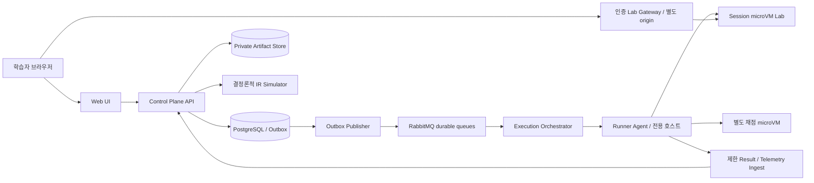

# SecDrill 시스템 아키텍처

도메인은 모듈러 모놀리스로 시작하되 비신뢰 코드 실행은 별도 호스트와 배포 단위로 분리한다. 보안 실습의 공격자가 Control Plane과 채점기를 동시에 소유하지 않도록 한다.

## 배포 단위와 책임

Web은 TypeScript 기반 작업 공간이고 서버가 제공한 결과만 표시한다. Control Plane은 Kotlin/Spring 기반 Identity, Catalog, Session, Submission, Evaluation, Evidence, Recommendation, Operations 모듈이다. 각 모듈은 자신의 저장소만 수정하고 다른 모듈과 application service 또는 event로 협력한다.

Orchestrator는 job scheduling·quota·lease·fencing·runner 선택을 수행한다. Runner Agent는 호스트 자원과 microVM 생명주기를 관리하고 Control DB 자격증명을 갖지 않는다. Lab Gateway는 짧은 접속 토큰과 Session 권한을 검증하며 사용자 임의 주소로 proxy하지 않는다. Result Ingest는 mTLS workload identity와 job·attempt·digest를 검증한 제한 JSON만 수신한다.

기술 제안은 PostgreSQL, S3 호환 private store, RabbitMQ quorum queue, Redis rate-limit/cache, OpenTelemetry다. broker 선택은 CodeDrill의 분리 실행 철학을 참고한 제안이고 SysDrill의 Redis queue 구현을 그대로 복제하지 않는다. 라이브러리·런타임 patch 버전은 구현 시 검증한다.

## 신뢰 경계

Lab에는 외부 인터넷·Control DB·브로커·오브젝트 스토어 credentials가 없다. Agent는 실행 대상 바깥의 관리 프로세스이며 outbound만 허용한 제한 ingest·artifact 경로를 갖는다. 제출물·Lab telemetry·사용자 출력은 신뢰하지 않는다. hidden tests는 채점 VM에서만 읽고 학습용 실행의 filesystem과 공유하지 않는다. 채점 VM에도 DB·장기 비밀을 주지 않는다.

## 정합성과 확장

PostgreSQL이 상태·제출·원장·job의 진실의 원천이다. Redis와 UI cache는 재구성 가능하다. ArtifactStore는 대용량 immutable bytes를 보관하고 DB가 권한·digest·보관기간을 관리한다. queue 장애 시 Outbox가 보존되며 API는 수락과 실행 완료를 구분한다.

시뮬레이션은 순수 reducer, 실제 Lab는 관측 기록을 제공한다. 실제 인프라 결과를 seed만으로 재현 가능하다고 주장하지 않는다. 초기 20 Labs 한도를 초과하면 fair queue와 사용자 quota로 제어하고 Runner pool을 독립 확장한다. control API와 runner를 같은 host에 colocate하는 구성은 신뢰된 로컬 개발만 허용한다.
