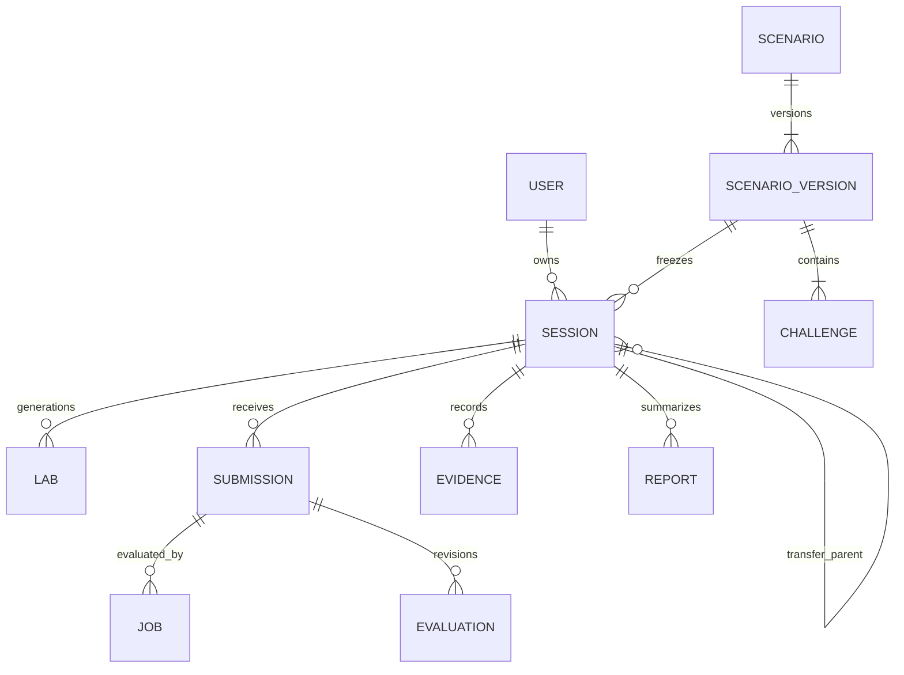

# SecDrill 도메인 모델

Aggregate는 상태와 불변식을 소유한다. 참조는 UUID로 연결하고 다른 Aggregate의 테이블을 직접 수정하지 않는다. 여러 원자 변경이 필요한 생성·제출 경로는 Control Plane application transaction에서 조립한다.

| Aggregate | 소유 데이터 | 불변식 |
|---|---|---|
| Identity | User, AuthSession, Consent | 폐기된 로그인 세션 즉시 거절 |
| Scenario | Scenario, ScenarioVersion, Challenge | 출판 버전 immutable; 허용 모드 검증 |
| Session | 버전·seed·모드·phase·version | 한 owner, 한 고정 콘텐츠 버전; terminal 상태 역전 금지 |
| Lab | generation, lease, runtime refs | 한 사용자 활성 실제 Lab; 회수 확인 전 새 quota 해제 금지 |
| Submission | kind, artifact, explanation | canonical 입력 digest immutable; idempotency key 재사용 검사 |
| Job | attempt, lease, fencing, result | 현재 lease만 결과 반영; dispatch 대기와 execution lease 분리 |
| Evaluation | revision, policy, verdict, gates | 이전 revision 보존; 활성 결과 하나 |
| Ledger | head seq/hash, Evidence entries | seq 단조 증가; raw privacy payload 분리 |
| Report | evidence refs, revision snapshot | 당시 평가 revision 고정 |
| SkillProjection | taxonomy·policy·watermark | 재계산 가능; evidence를 수정하지 않음 |

## Value Object

ArtifactRef는 key, digest, size, mediaType, sensitivity, expiresAt이다. VersionBundle은 contentDigest, rubricVersion, engineVersion, randomizationVersion이다. ObjectiveResult는 challengeId, observedEvidenceIds, verdict, confidenceScope다. ActionCommand는 actionType, parameters, expectedVersion, clientRequestId다.

## 접근 경계

Session 조회는 owner를 기본으로 하며 MVP 조직 공유는 없다. 운영자는 작업 목적·감사 ID를 가진 별도 token으로 접근한다. 실행 영역은 Session owner 개인정보 대신 jobId·session pseudonym·fixed bundle만 받는다. challenge oracle와 rubric private payload는 learner-facing Catalog DTO로 매핑하지 않는다.

## 모드 전환과 재실행

CTF에서 Purple로 이어가기와 Transfer는 새 Session을 생성하고 parentSessionId를 기록한다. parent 노출·도움 사실은 추천과 평가에 전달한다. Lab reset은 같은 Session의 새 generation이며 공식 제출·도움 이력은 유지한다. TERMINATED Lab는 다시 RUNNING으로 되돌리지 않는다.
